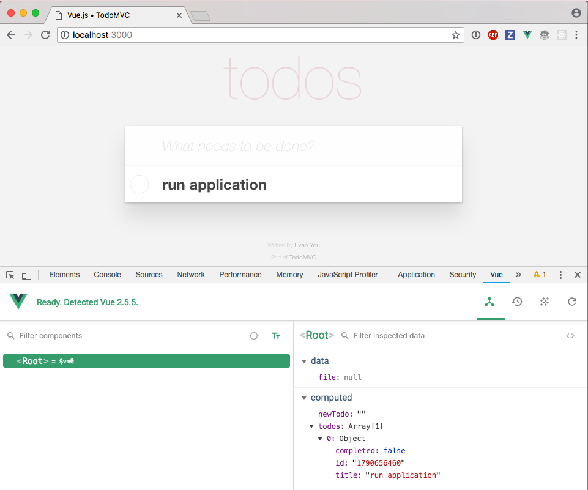
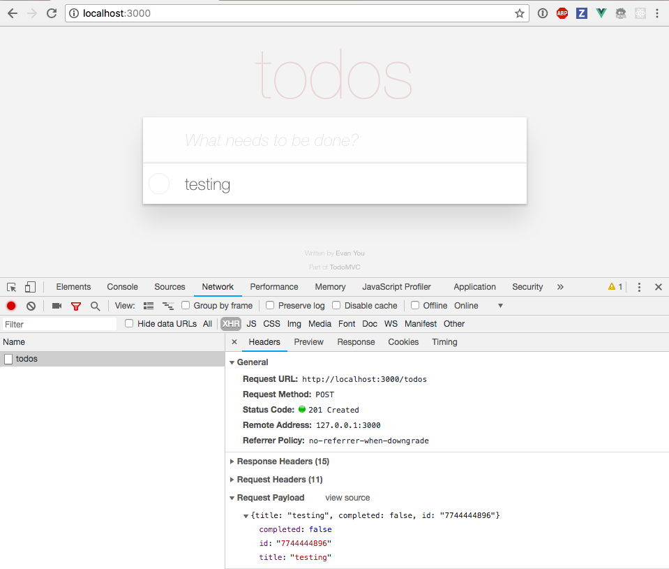
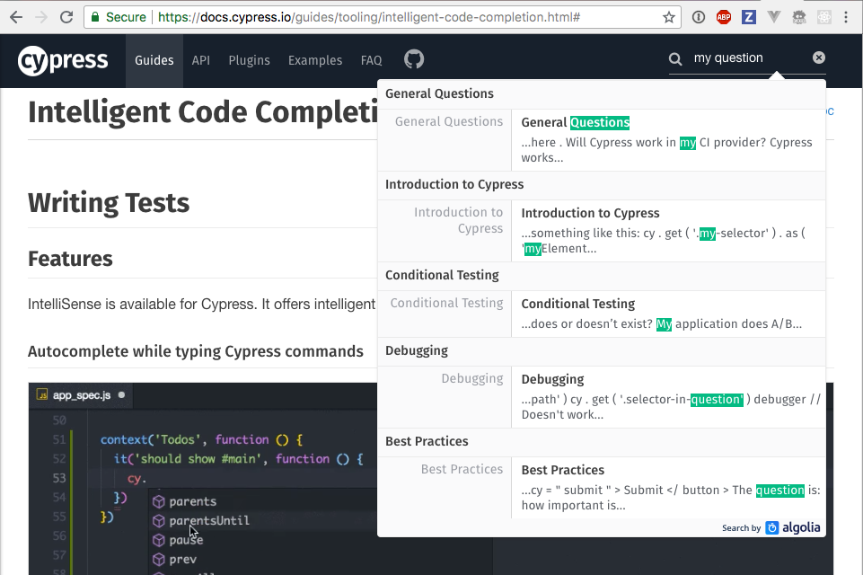

# End-to-end testing with [Cypress.io](https://cypress.io)

+++

# Gleb Bahmutov, PhD

## VP of Engineering, Cypress

## contact

- gleb (at) cypress.io
- [@bahmutov](https://twitter.com/bahmutov)

---

## Repo organization

- `/todomvc` is a web application we are going to test
- `00-start`, `01-...` individual steps

---

## `todomvc`

Let us look at the application.

- `cd todomvc`
- `npm install`
- `npm start`
- `open localhost:3000`

+++

It is a regular TodoMVC application.


+++

If you have Vue DevTools plugin



+++

Look at XHR when using the app



+++

Look at `index.html`


+++

Look at `app.js`


+++

## Questions

- what happens when you add a new Todo item?
- how does it get to the server?
- where does the server save it?
- what happens on start up?

---

## Start testing

- `cd 00-start`
- install Cypress with `npm i -D cypress`
- open Cypress with `npm run cy:open`

+++

Look at the scaffolded example test files (specs).

Delete them.

+++

## First spec

- `cypress/integration/spec.js`

+++

```javascript
/// <reference types="cypress" />
it('loads', () => {
  cy.visit('localhost:3000')
})
```

## Questions

- what does Cypress do?
- what happens when the server is down?
- why do we need `reference types ...` line?

+++

## Docs

Your best friend is [https://docs.cypress.io/](https://docs.cypress.io/)



+++

## IntelliSense

