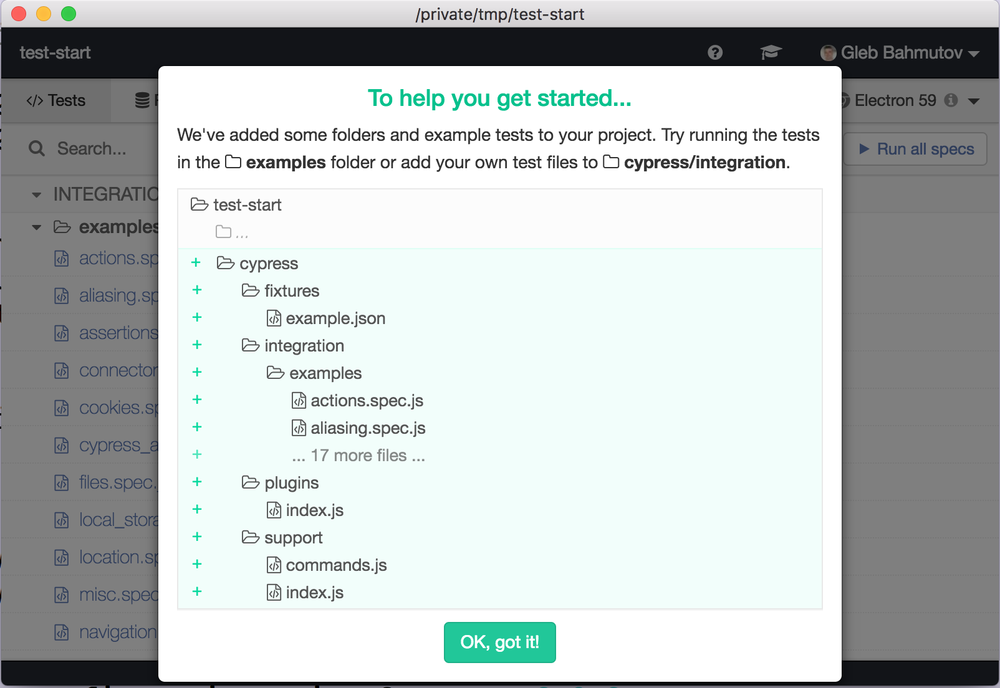
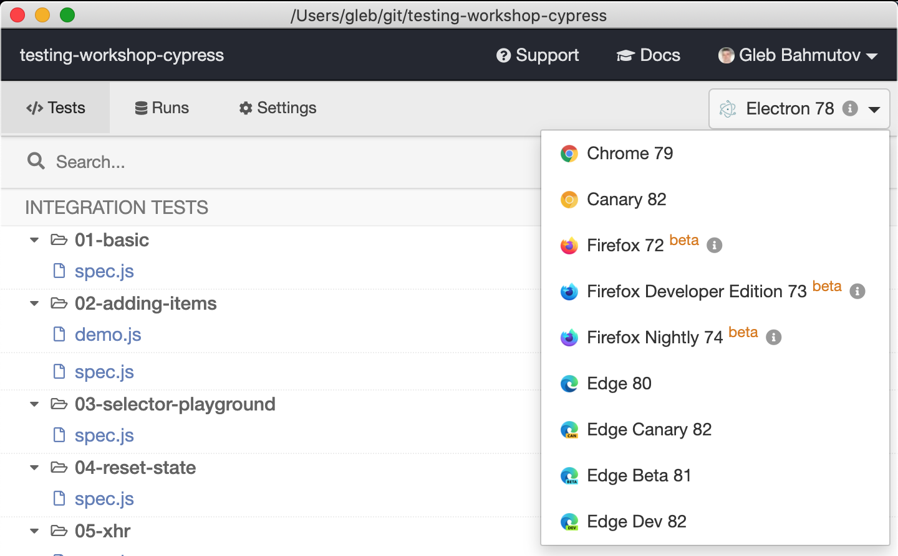
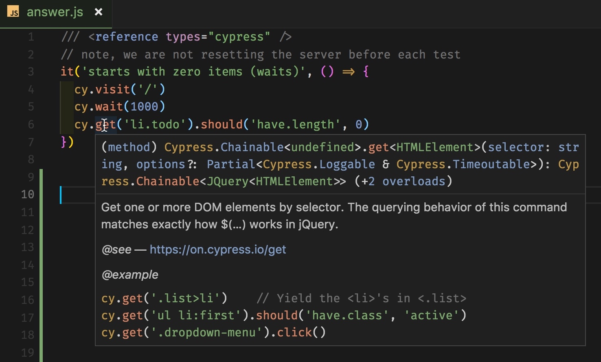
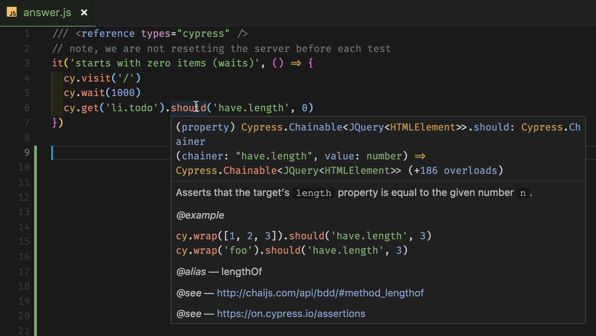
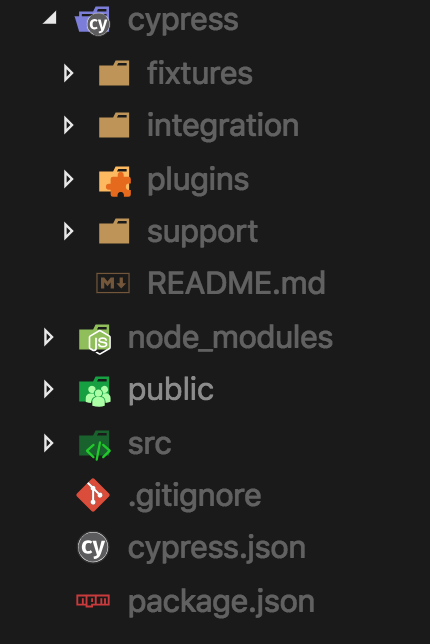

## ☀️ Starting new projects

### 📚 You will learn

- Cypress folder structure
- Writing first test
- Setting up intelligent code completion
- Cypress documentation

+++

## Todo: make a new project and add Cypress

Create a new folder

- `cd /tmp`
- `mkdir example`
- `cd example`
- `npm init --yes`
- `npm install -D cypress`

+++

### How to open Cypress

```
npx cypress open
$(npm bin)/cypress open
./node_modules/.bin/cypress open
```

+++

In `package.json` I usually have

```json
{
  "scripts": {
    "cy:open": "cypress open",
    "cy:run": "cypress run"
  }
}
```

And I use `npm run cy:open`

+++



+++

- "cypress.json" - all Cypress settings
- "cypress/integration" - test files (specs)
- "cypress/fixtures" - mock data
- "cypress/plugins" - extending Cypress
- "cypress/support" - shared commands, utilities

Note:
This section shows how Cypress scaffolds its files and folders. Then the students can ignore this folder. This is only done once to show the scaffolding.

+++

Look at the scaffolded example test files (specs).

Run specs for topics that look interesting

Hint: you can find latest examples in [https://github.com/cypress-io/cypress-example-kitchensink](https://github.com/cypress-io/cypress-example-kitchensink)

+++

## 💡 Pro tip

```
npx @bahmutov/cly init
# quickly scaffolds Cypress folders
```

Repo [github.com/bahmutov/cly](https://github.com/bahmutov/cly)

+++

## Cypress example kitchen sink

- repo [github.com/cypress-io/cypress-example-kitchensink](https://github.com/cypress-io/cypress-example-kitchensink)
- site [example.cypress.io](https://example.cypress.io)
- **Tip:** also use [glebbahmutov.com/cypress-examples](https://glebbahmutov.com/cypress-examples)

+++
## First spec

Create a new file

- `cypress/integration/spec.js`

+++

Type into the `spec.js`

```javascript
it('loads', () => {
  cy.visit('localhost:3000')
})
```

+++

- make sure you have started TodoMVC in another terminal with `npm start`
- click on "spec.js" in Cypress GUI

+++

## Questions

- what does Cypress do?
- what happens when the server is down?
  - stop the application server running in folder `todomvc`
  - reload the tests

+++

## Switch browser



+++

```javascript
/// <reference types="cypress" />
it('loads', () => {
  cy.visit('localhost:3000')
})
```

- why do we need `reference types ...` line?

Note:
By having "reference" line we tell editors that support it (VSCode, WebStorm) to use TypeScript definitions included in Cypress to provide intelligent code completion. Hovering over any `cy` command brings helpful tooltips.

+++

## IntelliSense



+++

Every Cypress command and every assertion



+++

Using `ts-check`

```javascript
/// <reference types="cypress" />
// @ts-check
it('loads', () => {
  cy.visit('localhost:3000')
})
```

- what happens if you add `ts-check` line and misspell `cy.visit`?

Note:
The check works really well in VSCode editor. I am not sure how well other editors support Cypress type checks right out of the box.

+++

## Docs

Your best friend is [https://docs.cypress.io/](https://docs.cypress.io/)


+++

## Find at docs.cypress.io

@ul
- Cypress main features and how it works docs
- core concepts
- command API
  - how many commands are there?
@ulend

+++

## 💡 Pro tip

```
https://on.cypress.io/<command>
```

goes right to the documentation for that command.

+++

## Find at docs.cypress.io

@ul
- examples
  - recipes
  - tutorial videos
  - example applications
  - blogs
  - FAQ
- Cypress changelog and roadmap
@ulend

Note:
Students should know where to find information later on. Main resources is the api page [https://on.cypress.io/api](https://on.cypress.io/api)

+++

@snap[west]

@snapend

@snap[east]
Bonus: extension [vscode-icons](https://github.com/vscode-icons/vscode-icons)
@snapend

+++

## 🏁 Conclusions

- use IntelliSense
- use Docs are [https://docs.cypress.io/](https://docs.cypress.io/)

➡️ Pick the [next section](https://github.com/cypress-io/testing-workshop-cypress#content-)
