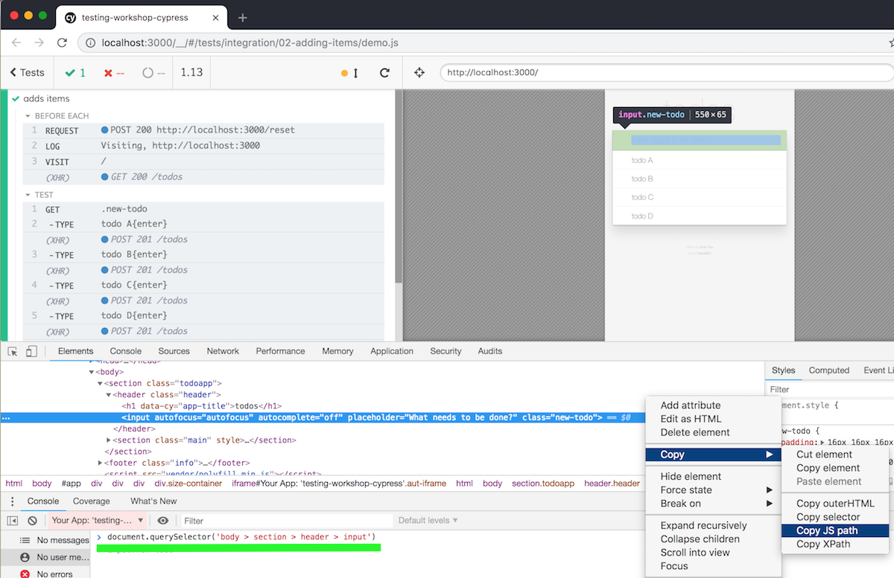
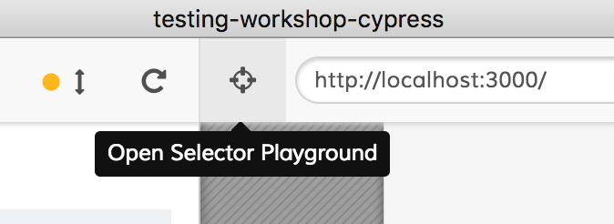
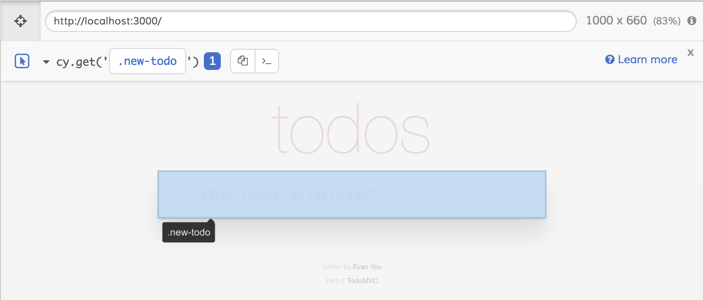
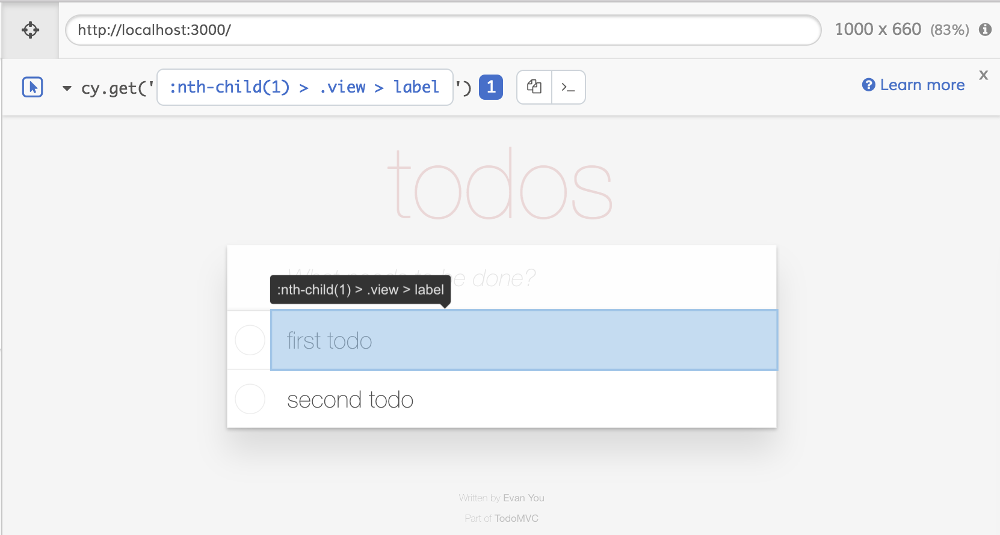
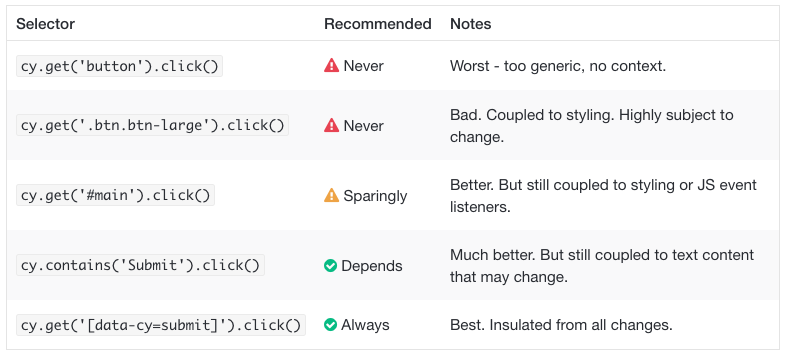
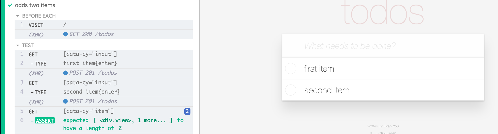
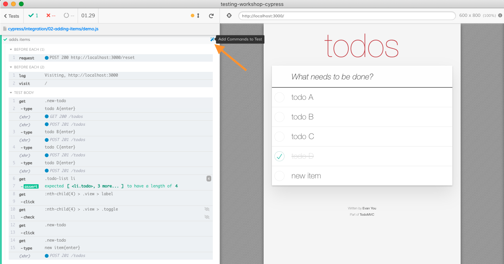

## ☀️ Part 3: Selector playground

### 📚 You will learn

- Cypress Selector Playground tool
- best practices for selecting elements

+++

- keep `todomvc` app running
- open `03-selector-playground/spec.js`

+++

> How do we select element in `cy.get(...)`?

- Browser's DevTools can suggest selector

+++



+++

Open "Selector Playground"



+++

Selector playground can suggest much better selectors.



+++

⚠️ It can suggest a weird selector



+++

Read [best-practices.html#Selecting-Elements](https://docs.cypress.io/guides/references/best-practices.html#Selecting-Elements)



+++

## Todo

- add test data ids to `todomvc/index.html` DOM markup
- use new selectors to write `cypress/integration/03-selector-playground/spec.js`

Note:
The updated test should look something like the next image

+++



+++

## Cypress is just JavaScript

```js
import {selectors, tid} from './common-selectors'
it('finds element', () => {
  cy.get(selectors.todoInput).type('something{enter}')

  // "tid" forms "data-test-id" attribute selector
  // like "[data-test-id='item']"
  cy.get(tid('item')).should('have.length', 1)
})
```

+++
## Cypress Studio

Record tests by clicking on the page

```json
{
  "experimentalStudio": true
}
```

+++
## Start recording



+++
## 🏁 Selecting Elements

- Use Selector Playground
- follow [https://on.cypress.io/best-practices#Selecting-Elements](https://on.cypress.io/best-practices#Selecting-Elements)
- **bonus:** try [@testing-library/cypress](https://testing-library.com/docs/cypress-testing-library/intro)

+++

## 🏁 Quickly write tests

- pick elements using Selector Playground
- record tests using Cypress Studio

➡️ Pick the [next section](https://github.com/cypress-io/testing-workshop-cypress#content-)
