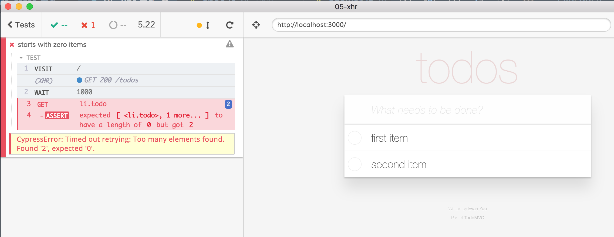
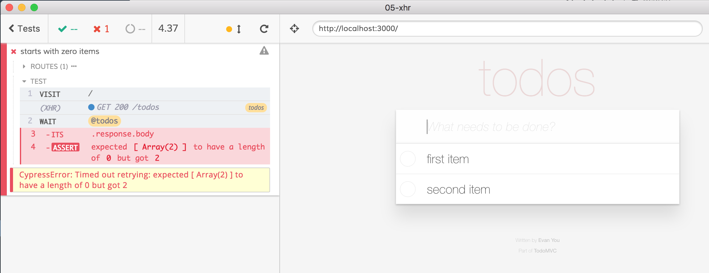
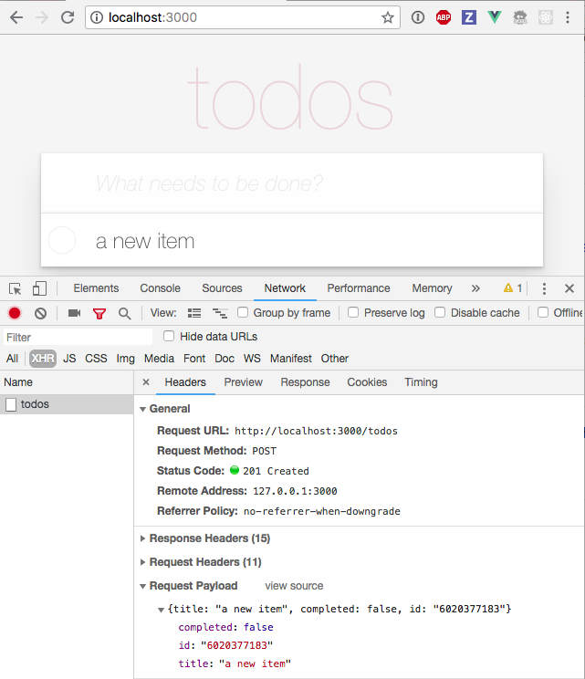

## Spying / stubbing network calls

- keep `todomvc` app running
- open `05-xhr/spec.js`
- **note** stubbing `window.fetch` is NOT implemented yet, but will be [issue #687](https://github.com/cypress-io/cypress/issues/687)

+++

## Situation

- there is no resetting the state before each test
- the test passes but _something is wrong_

```javascript
it('starts with zero items', () => {
  cy.visit('/')
  cy.get('li.todo').should('have.length', 0)
})
```


+++

## Problem

- page loads
- web application makes XHR call `GET /todos`
  - meanwhile it shows an empty list of todos
- Cypress assertion passes!
- `GET /todos` returns with 2 items
  - they are added to the DOM
  - but the test has already finished

+++

## Waiting

```javascript
it('starts with zero items', () => {
  cy.visit('/')
  cy.wait(1000)
  cy.get('li.todo').should('have.length', 0)
})
```



+++

## Todo

**better** to wait on a specific XHR request

- start Cypress mock server with `cy.server`
  - should we start mock server _before_ or _after_ `cy.visit`?
- spy on specific route with `cy.route`
- save as an alias
- wait on the XHR alias
  - then check the DOM

+++

## Tips

- [`cy.server`](https://on.cypress.io/server)
- [`cy.route`]('https://on.cypress.io/route)
- [Network requests guide](https://on.cypress.io/network-requests)

+++

## Todo

- wait for the XHR alias
- its response body should be an empty array



+++

## Stub network call

- instead of just spying on XHR call, let's return some mock data

```javascript
// returns an empty list
// when `GET /todos` is requested
cy.route('GET', '/todos', [])
```

+++

## Questions

- read about [`cy.fixture`](http://on.cypress.io/fixture) command
- mock `GET /todos` route using data loaded from a fixture
- mock `GET /todos` using `fixture:empty-list` shortcut
- write a test that confirms that the app shows correctly completed and unfinished items

+++

## Spying on adding an item XHR

When you add an item through the DOM, the app makes `POST` XHR call.



+++

## Todo 1/2

- write a test that confirms that new item is posted to the server


+++

## Todo 2/2

- write a test that confirms that RESPONSE when a new item is posted to the server


+++

## Bonus

Network requests guide at [https://on.cypress.io/network-requests](https://on.cypress.io/network-requests)
