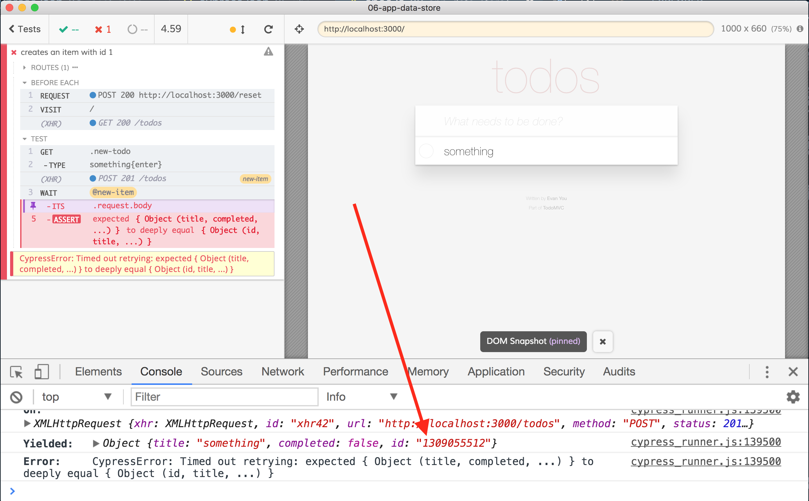
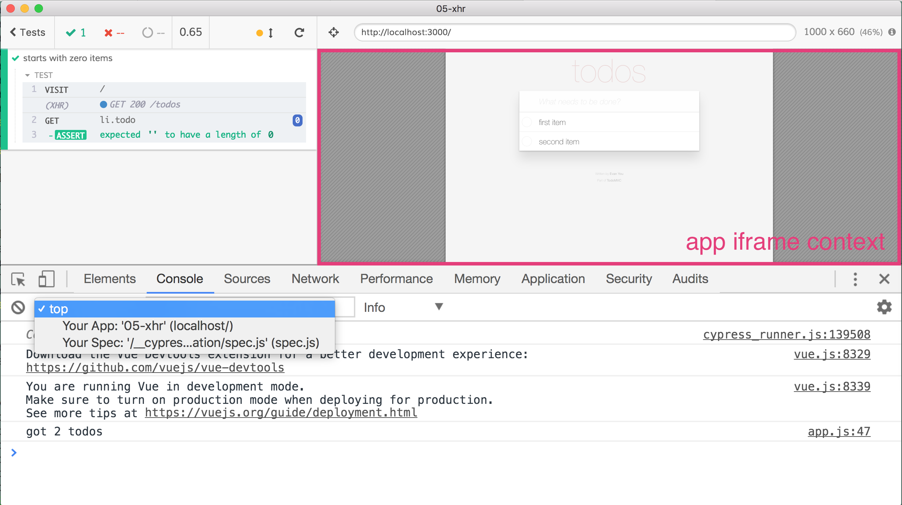
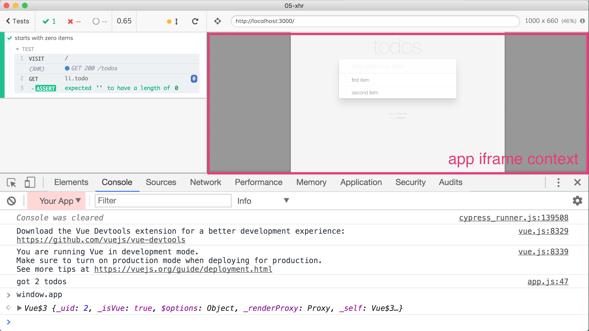

## ☀️ Part 6: Application data store

### 📚 You will learn

- how to access the running application from test code
- how to stub a method in the application
- how to drive application by dispatching actions

+++

- keep `todomvc` app running
- open `cypress/integration/06-app-data-store/spec.js`
- test that Vuex data store is working correctly

+++

## Application object

```javascript
// if you want to expose "app" globally only
// during end-to-end tests you can guard it using "window.Cypress" flag
// if (window.Cypress) {
window.app = app
// }
```

+++

## Todo: check Vuex state

```javascript
it('adds items to store', () => {
  addItem('something')
  addItem('something else')
  // get application's window
  // then get app, $store, state, todos
  // it should have 2 items
})
```

+++



+++

## Non-determinism

- random data in tests makes it very hard
- UUIDs, dates, etc
- Cypress includes XHR and method stubbing using [http://sinonjs.org/](http://sinonjs.org/)
- [https://on.cypress.io/stubs-spies-and-clocks](https://on.cypress.io/stubs-spies-and-clocks)

+++

## Questions

- how does a new item get its id?
- can you override random id generator from DevTools?

+++

## Iframed contexts



+++

## Application under test



+++

## Stub application's random generator

- test "creates an item with id 1" in `06-app-data-store/spec.js`
- get the application's context using `cy.window`
- get application's `window.Math` object
- can you stub application's random generator?
  - **hint** use `cy.stub`

+++

## Confirm spy's behavior

- test "creates an item with id using a stub"
- write a test that adds 1 item
- name spy with an alias `cy.spy(...).as('name')`
- get the spy using the alias and confirm it was called once

+++

## Application data store

- inspect in DevTools 'window.app' variable
- can you find the items in the data store as they are added?
  - **hint** you might need 'JSON.parse(JSON.stringify(...))' to get a "simple" object

Note:
Our goal is to show that anything one can do from the DevTools can be done from the end-to-end tests using `cy.window` to get to the application's window. Application code can even expose some objects during testing using `if (window.Cypress) ...` conditions.

+++

## Todo

Write a test that:

- adds 2 todos
- gets the data store
- confirms the objects in the data store

+++

## Advanced

Write a test that:

- dispatches actions to the store to add items
- confirms new items are added to the DOM

(see next slide)
+++

```js
it('adds todos via app', () => {
  // bypass the UI and call app's actions directly from the test
  // app.$store.dispatch('setNewTodo', <desired text>)
  // app.$store.dispatch('addTodo')
  // using https://on.cypress.io/invoke
  // bypass the UI and call app's actions directly from the test
  // app.$store.dispatch('setNewTodo', <desired text>)
  // app.$store.dispatch('addTodo')
  // and then check the UI
})
```

+++
## Todo: test edge data case

```js
it('handles todos with blank title', () => {
  // add todo that the user cannot add via UI
  cy.window()
    .its('app.$store')
    .invoke('dispatch', 'setNewTodo', '  ')
  // app.$store.dispatch('addTodo')
  // confirm the UI
})
```

+++

### ⚠️ Watch out for stale data

Note that the web application might NOT have updated the data right away. For example:

```js
getStore().then(store => {
  store.dispatch('setNewTodo', 'a new todo')
  store.dispatch('addTodo')
  store.dispatch('clearNewTodo')
})
// not necessarily has the new item right away
getStore().its('state')
```

Note:
In a flaky test https://github.com/cypress-io/cypress-example-recipes/issues/246 the above code was calling `getStore().its('state').snapshot()` sometimes before and sometimes after updating the list of todos.

+++

### ⚠️ Watch out for stale data

**Solution:** confirm the data is ready before using it.

```js
// add new todo using dispatch
// retry until new item is in the list
getStore()
  .its('state.todos')
  .should('have.length', 1)
// do other checks
```

+++
## 🏁 App Access

- when needed, you can access the application directly from the test

Read also: https://www.cypress.io/blog/2018/11/14/testing-redux-store/
