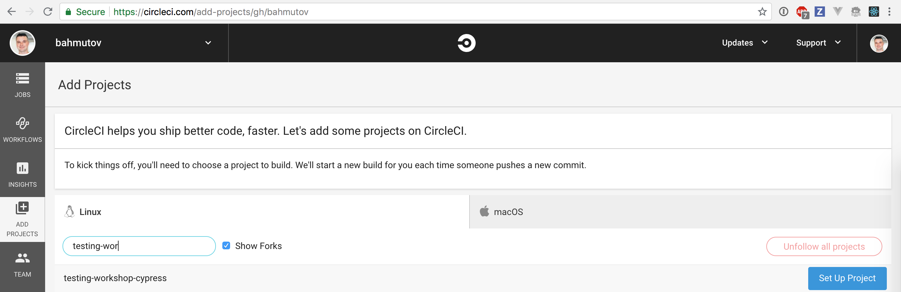

## ☀️ Part 7: Continuous integration

### 📚 You will learn

- Cypress Docker images for dependencies
- Installing and caching Cypress itself
- How to start server and run Cypress tests
- CircleCI Orb example
- GitHub Actions example

+++

## Todo if possible

- sign up for free account on CircleCI
- use specs from folder `cypress/integration/07-ci`
  - UI spec
  - Data store spec
  - API calls spec

+++

## Questions

- look at the scripts in `package.json`
- run the specs in the interactive mode with `cypress open`
- run the specs in the headless mode with `cypress run`

+++

## Set up CI

- sign up for CircleCI
- fork this repo [cypress-io/testing-workshop-cypress](https://github.com/cypress-io/testing-workshop-cypress)
- add project to CircleCI



+++

## Continuous integration documentation

- [https://on.cypress.io/continuous-integration](https://on.cypress.io/continuous-integration)
- [https://on.cypress.io/ci](https://on.cypress.io/ci) (alias)

+++

## Todo

Read file `.circleci/circle.yml`

- uses CircleCI V2 [https://circleci.com/docs/2.0/sample-config/](https://circleci.com/docs/2.0/sample-config/)
- Docker file from [https://github.com/cypress-io/cypress-docker-images](https://github.com/cypress-io/cypress-docker-images)
  - `cypress/base:8`, `cypress/base:10`, `cypress/base:12.x.y` are good choices

+++

## On CI:

- install and cache dependencies
- start `todomvc` server in the background
- run spec files from `cypress/integration/07-ci`

+++

```yaml
version: 2
jobs:
  build:
    docker:
      - image: cypress/base:8
    working_directory: ~/repo
    steps:
      - checkout
      - restore_cache:
          keys:
          - dependencies-{{ checksum "package.json" }}
          # fallback to using the latest cache if no exact match is found
          - dependencies-
      - run:
          name: Install dependencies
          # https://docs.npmjs.com/cli/ci
          command: npm ci
      - save_cache:
          paths:
            - ~/.npm
            - ~/.cache
          key: dependencies-{{ checksum "package.json" }}
```

@[4-5](Use Cypress Docker image with Node 8)
@[9-13](Restore previously cached dependencies)
@[14-17](Install NPM dependencies)
@[18-22](Save dependencies, including Cypress binary in ~/.cache)

+++

```yaml
# two commands: start server, run tests
- run:
    name: Start TodoMVC server
    command: npm start
    working_directory: todomvc
    background: true
- run:
    name: Run Cypress tests
    command: npm test
```

@[2-6](Start application server)
@[7-9](Run Cypress tests)

+++

Alternative: use [start-server-and-test](https://github.com/bahmutov/start-server-and-test)

```yaml
- run:
  name: Start and test
  command: npm run ci
```

```json
{
  "scripts": {
    "start": "cd todomvc; npm start -- --quiet",
    "test": "cypress run --spec 'cypress/integration/07-ci/*'",
    "ci": "start-test 3000"
  }
}
```

+++

## CircleCI Cypress Orb

A *much simpler* CI configuration.

```yaml
version: 2.1
orbs:
  # import Cypress orb by specifying an exact version x.y.z
  # or the latest version 1.x.x using "@1" syntax
  cypress: cypress-io/cypress@1
workflows:
  build:
    jobs:
      # "cypress" is the name of the imported orb
      # "run" is the name of the job defined in Cypress orb
      - cypress/run
```

+++

## Todo

Look how tests are run on Firefox in [.circleci/config.yml](.circleci/config.yml) using [cypress-io/circleci-orb](https://github.com/cypress-io/circleci-orb).

+++

## Record on Dashboard

```yaml
version: 2.1
orbs:
  cypress: cypress-io/cypress@1
workflows:
  build:
    jobs:
      - cypress/run:
          record: true
```

+++

## Parallel builds

```yaml
version: 2.1
orbs:
  cypress: cypress-io/cypress@1
workflows:
  build:
    jobs:
      - cypress/install
      - cypress/run:
          requires:
            - cypress/install
          record: true # record results on Cypress Dashboard
          parallel: true # split all specs across machines
          parallelism: 4 # use 4 CircleCI machines
```

+++

## CircleCI Cypress Orb

Never struggle with CI config 👍

- [github.com/cypress-io/circleci-orb](https://github.com/cypress-io/circleci-orb)
- [circleci.com/orbs/registry/orb/cypress-io/cypress](https://circleci.com/orbs/registry/orb/cypress-io/cypress)
- 📺 [CircleCI + Cypress webinar](https://youtu.be/J-xbNtKgXfY)

+++

## GitHub Actions

- cross-platform CI built on top of Azure CI + MacStadium
- Linux, Windows, and Mac
- We wrote [cypress-io/github-action](https://github.com/cypress-io/github-action)

+++

```yaml
jobs:
  cypress-run:
    runs-on: ubuntu-latest
    steps:
      - uses: actions/checkout@v1
      - uses: cypress-io/github-action@v1
        with:
          start: npm start
          wait-on: 'http://localhost:3000'
          spec: 'cypress/integration/07-ci/*'
```

@[5](Checkout GitHub repo)
@[6-10](Run Cypress tests)

+++

## Take away

- use `npm ci` command instead of `npm install`
- cache `~/.npm` and `~/.cache` folders
- use [start-server-and-test](https://github.com/bahmutov/start-server-and-test) for simplicity
- store video as artifact with [store_artifacts](https://circleci.com/docs/2.0/configuration-reference/#store_artifacts)

+++

## Todo

Find the CI you use on [https://on.cypress.io/continuous-integration](https://on.cypress.io/continuous-integration) and [https://github.com/cypress-io/cypress-example-kitchensink#ci-status](https://github.com/cypress-io/cypress-example-kitchensink#ci-status)
