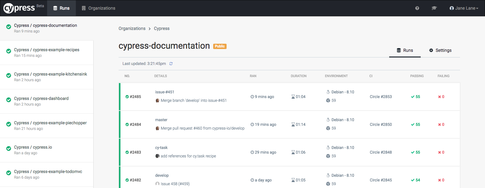

## ☀️ Part 8: The Dashboard

### 📚 You will learn

- Purpose for Cypress Dashboard
- How to send test results to Cypress Dashboard
- Test parallelization using Cypress Dashboard

+++

- CI is nice, but
  - artifacts are all over the place
  - no consistent view of the tests

+++

## Cypress dashboard



+++

- store test results and videos
- insight into each failure
- parallel test execution
- GitHub integration
- analytics (WIP)

+++

- extend work in `07-ci` folder
- open Cypress test runner in interactive mode
- click "Runs / Set up project to record"


+++

## Record your test runs

- record a test run locally
- look at the test results at Cypress dashboard
- set the variables and commands to record from CI

**tip** [https://on.cypress.io/dashboard-faq](https://on.cypress.io/dashboard-faq)

+++

## Bonus

- pass record key as an environment variable
- make a test to fail on purpose
- look at the test failure on the dashboard

+++

## Big bonus: Parallelization

- run tests on N machines in 1/N time with [https://on.cypress.io/parallelization](https://on.cypress.io/parallelization)
- 📺 [Cypress parallelization webinar](https://youtu.be/FfqD1ExUGlw)

```sh
npx cypress run --record --parallel
```
