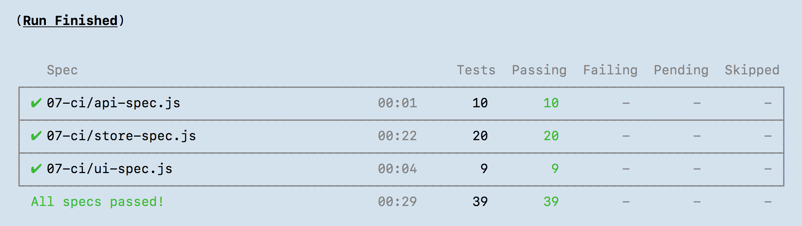
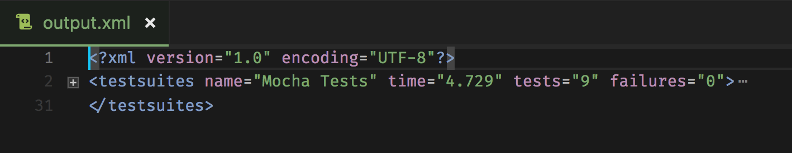
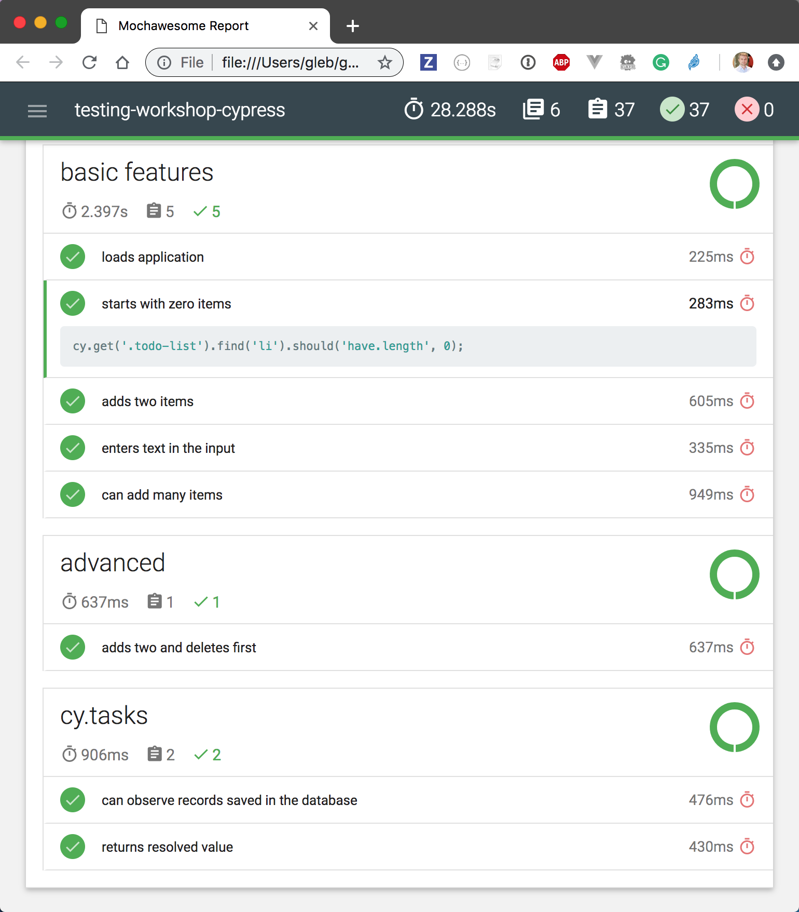

## ☀️ Part 9: Reporters

### 📚 You will learn

- built-in reporters
- generating multiple reports
- combining separate reports

+++

- Mocha's [built-in reporters](https://mochajs.org/#reporters) come with Cypress
- [https://on.cypress.io/reporters](https://on.cypress.io/reporters)

+++

## Todo: try a different reporter

There are `json`, `list`, `markdown`, etc, see [https://mochajs.org/#reporters](https://mochajs.org/#reporters)

```json
{
  "reporter": "list"
}
```

and run `npm test`.

Note:
Each reporter changes the `STDOUT` output.

+++

## Todo: use built-in `junit` reporter

Bonus: direct output to a different file

```json
{
  "reporter": "junit",
  "reporterOptions": {
    "mochaFile": "cypress/results/output.xml"
  }
}
```

+++

## Question

Are all test results in the saved output file?





+++

## Todo: report per spec

```json
{
  "reporter": "junit",
  "reporterOptions": {
    "mochaFile": "cypress/results/output-[hash].xml",
    "toConsole": true
  }
}
```

Note:
Option `reporterOptions.toConsole = true` mirrors JUnit reports to `STDOUT`.
Filename with `[hash]` will save individual report per spec. Remember to clean the output folder before running the tests like `rm cypress/results/* || true && npm test`.

+++

## mocha-multi-reporters

I want to output `spec` to `STDOUT` _and_ save `junit` reports. Use [mocha-multi-reporters](https://github.com/stanleyhlng/mocha-multi-reporters) and install all peer dependencies.

```sh
npm i -D mocha mocha-multi-reporters mocha-junit-reporter
```

```json
{
  "reporter": "mocha-multi-reporters",
  "reporterOptions": {
    "reporterEnabled": "spec, mocha-junit-reporter",
    "mochaJunitReporterReporterOptions": {
      "mochaFile": "cypress/results/output-[hash].xml"
    }
  }
}
```

+++

## Mochawesome

Let's generate [Mochawesome](https://github.com/adamgruber/mochawesome) individual JSON reports, merge them and then generate combined HTML report.

```sh
npm i -D mocha mochawesome \
  mochawesome-merge mochawesome-report-generator
```

```json
{
  "reporter": "mochawesome",
  "reporterOptions": {
    "reportDir": "cypress/results",
    "overwrite": false,
    "html": false,
    "json": true
  }
}
```

Note:
This should produce files in `cypress/results` like `mochawesome.json`, `mochawesome_001.json`, `mochawesome_002.json`. Then we need to merge them into a single JSON.

+++

## Merge and generate HTML report

```sh
$(npm bin)/mochawesome-merge --reportDir cypress/results > mochawesome.json
$(npm bin)/marge mochawesome.json
```

Uses [https://github.com/adamgruber/mochawesome-report-generator](https://github.com/adamgruber/mochawesome-report-generator) - aka `marge`

Note:
`$(npm bin)/marge` is the bin alias of `mochawesome-report-generator` package. This should save beautiful report `mochawesome-report/mochawesome.html`.

+++



