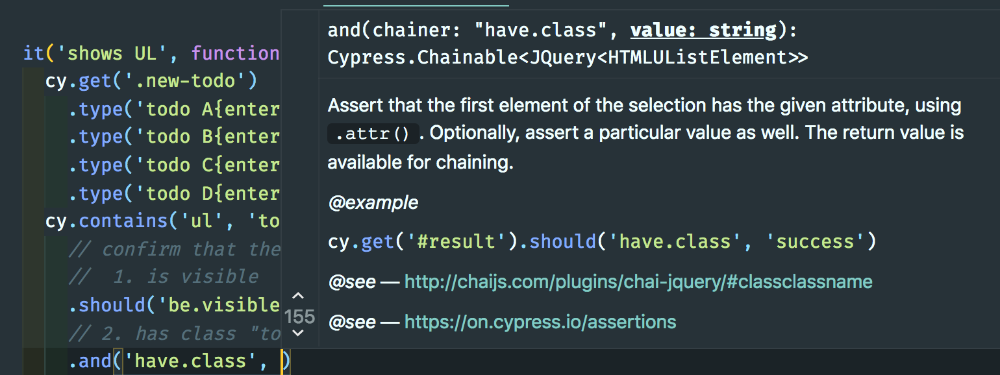
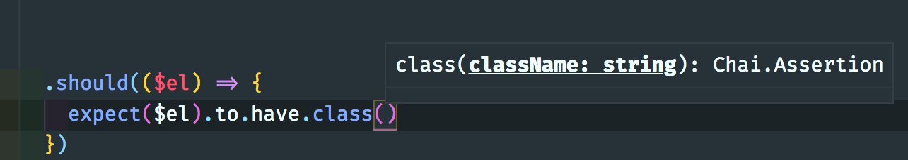
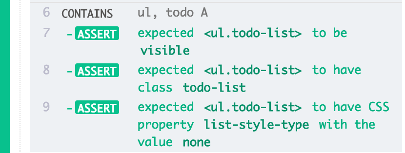
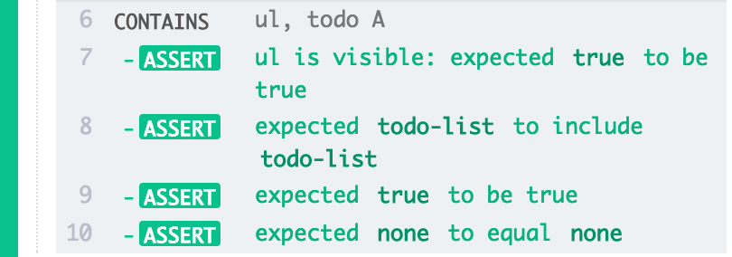
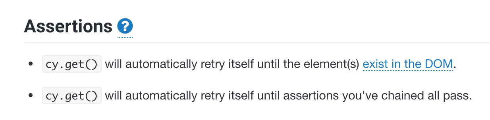
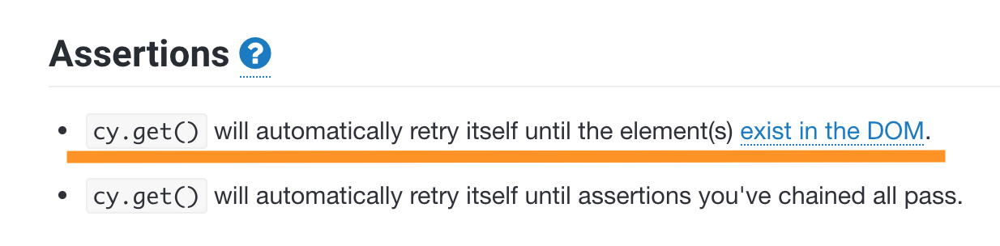
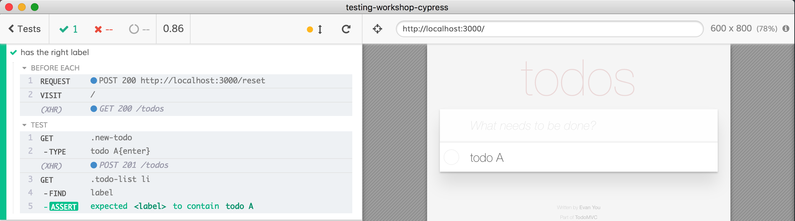
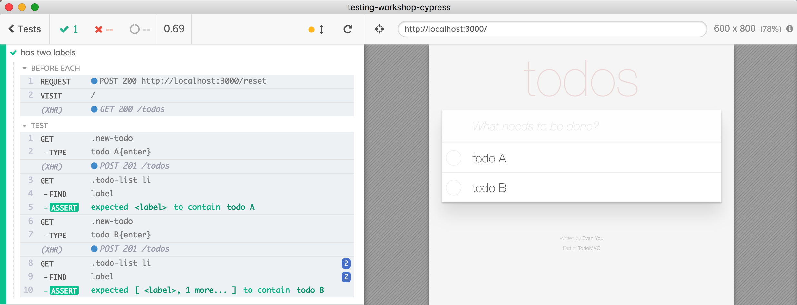

## ☀️ Part 11: Retry-ability

### 📚 You will learn

- deep dive into assertions
- built-in command waits
- retry-ability 🔑
- aliases

+++

- keep `todomvc` app running
- open `cypress/integration/11-retry-ability/spec.js`

+++

## Todo: finish the test "shows UL"

```js
it('shows list of items', function () {
  // ...
  cy.contains('ul', 'todo A')
  // confirm that the above element
  //  1. is visible
  //  2. has class "todo-list"
  //  3. css property "list-style-type" is equal "none"
})
```

+++

Most assertions I write are BDD

```js
cy.contains('ul', 'todo A').should('be.visible')
expect($el).to.have.prop('disabled', false)
```

[on/assertions#BDD-Assertions](https://on.cypress.io/assertions#BDD-Assertions)

+++

1, 2, or 3 arguments

```js
.should('be.visible')
.should('have.class', 'todo-list')
.should('have.css', 'list-style-type', 'none')
```

+++

## There is IntelliSense



+++

⚠️ straight Chai IntelliSense is not so good



+++

If you must, there are TDD assertions like

```js
assert.equal(3, 3, 'values are equal')
assert.isTrue(true, 'this value is true')
```

[on/assertions#TDD-Assertions](https://on.cypress.io/assertions#TDD-Assertions)

+++

## Todo: BDD vs TDD

Finish test "shows UL - TDD"

```js
it('shows UL - TDD', function () {
  cy.contains('ul', 'todo A').then($ul => {
    // use TDD assertions
    // $ul is visible
    // $ul has class "todo-list"
    // $ul css has "list-style-type" = "none"
  })
})
```

+++

## @fa[question](do you see the difference?)

Which style do you prefer?

⚠️ [Chai-jQuery](https://on.cypress.io/assertions#Chai-jQuery) and [Sinon-Chai](https://on.cypress.io/assertions#Sinon-Chai) are only available in BDD mode.

+++

## BDD


+++

## TDD


+++

## What if you need more complex assertions?

Write you own [should(cb)](http://on.cypress.io/should#Function) assertion

```js
cy.get('.docs-header').find('div')
  .should(($div) => {
    expect($div).to.have.length(1)
    const className = $div[0].className
    expect(className).to.match(/heading-/)
  })
```

+++

## Todo: write complex assertion

```js
it('every item starts with todo', function () {
  // ...
  cy.get('.todo label').should($labels => {
    // confirm that there are 4 labels
    // and that each one starts with "todo-"
  })
})
```

+++

## `should(cb)` common use cases

- dynamic data, like scoped class names
- text between two cells is unknown but should be the same
- displayed value should be the same as API has returned

[https://example.cypress.io/commands/assertions](https://example.cypress.io/commands/assertions)

+++

## 🔑 Retry-ability

> Key concept in Cypress, yet should go mostly unnoticed.

Note:
Add link to retry-ability page when finished https://github.com/cypress-io/cypress-documentation/pull/1314
+++

### Commands and assertions

```javascript
it('creates 2 items', function () {
  cy.visit('/')                       // command
  cy.focused()                        // command
    .should('have.class', 'new-todo') // assertion
  cy.get('.new-todo')                 // command
    .type('todo A{enter}')            // command
    .type('todo B{enter}')            // command
  cy.get('.todo-list li')             // command
    .should('have.length', 2)         // assertion
})
```

+++

### Look at the last command + assertion

```javascript
cy.get('.todo-list li')     // command
  .should('have.length', 2) // assertion
```

Command `cy.get()` will be retried _until_ the assertion `should('have.length', 2)` passes.

Note:
If not shown, this is a good moment to slow down the app and show how the assertion still works, especially when slowing down progressively - 1 item, slow down by 1 second, 2 items - slow down by 2 seconds.

+++

Command `cy.contains` will be retried _until 3 assertions_ that follow it all pass.

```js
cy.contains('ul', 'todo A')                   // command
  .should('be.visible')                       // assertion
  .and('have.class', 'todo-list')             // assertion
  .and('have.css', 'list-style-type', 'none') // assertion
```

+++

Command `cy.get` will be retried _until 5 assertions_ that follow it all pass.

```js
cy.get('.todo label')                 // command
  .should($labels => {
    expect($labels).to.have.length(4) // assertion

    $labels.each((k, el) => {         // 4 assertions
      expect(el.textContent).to.match(/^todo /)
    })
  })
```

+++

## Retry-ability

Only some commands are retried: `cy.get`, `cy.find`, `its`. They don't change the application's state.

NOT retried: `cy.click`, `cy.task`, etc.



+++

## `then(cb)` vs `should(cb)`

- `should(cb)` retries
- `then(cb)` does not retry

### Todo: demonstrate this

+++

## return value from `should(cb)`

Question: can you return value from `should(cb)`?

Note:
`Should(cb)` does not return a value, it just passes along the value yielded by the command. If you need a value, first call `should(cb)` and then `then(cb)` to return it.

+++

## Automatic Waiting



Built-in assertion in most commands, even if they do not retry assertions that follow. `cy.click` cannot click a button if there is no button, or if it's disabled!

Note:
Just like a human user, Cypress tries to do sensible thing. Very rarely though you need to retry a command that is NOT retried by Cypress, in that case you can perform it yourself, see [When Can the Test Click?](https://www.cypress.io/blog/2019/01/22/when-can-the-test-click/)

+++

## Timeouts

By default, command retries for up to 4 seconds. You can change config setting `defaultCommandTimeout` globally.

```sh
cypress run --config defaultCommandTimeout=10000
```

⚠️ changing global command timeout is not recommended.

+++

## Timeouts

Change timeout for a particular command

```js
// we've modified the timeout which affects
// default + added assertions
cy.get('.mobile-nav', { timeout: 10000 })
  .should('be.visible')
  .and('contain', 'Home')
```

See [Timeouts](https://on.cypress.io/introduction-to-cypress#Timeouts)

+++

> ⚠️ Only the last command is retried ⚠️

+++

### Todo: write test that checks the label



⌨️ test "has the right label"

+++

```js
it('has the right label', () => {
  cy.get('.new-todo').type('todo A{enter}')
  cy.get('.todo-list li')         // command
    .find('label')                // command
    .should('contain', 'todo A')  // assertion
})
```

+++

### Todo: write test that checks two labels



⌨️ test "has two labels"

+++

```js
it('has two labels', () => {
  cy.get('.new-todo').type('todo A{enter}')
  cy.get('.todo-list li') // command
    .find('label') // command
    .should('contain', 'todo A') // assertion

  cy.get('.new-todo').type('todo B{enter}')
  cy.get('.todo-list li') // command
    .find('label') // command
    .should('contain', 'todo B') // assertion
})
```

+++

## Add delay to the app

```js
// todomvc/app.js
addTodo ({ commit, state }) {
  // ...
  setTimeout(() => {
    axios.post('/todos', todo).then(() => {
      commit('ADD_TODO', todo)
    })
  }, 0)
},
```

> Is the test passing now?

+++

## Todo: debug the failing test

- inspect the failing command "FIND"
- inspect previous command "GET"
- what do you think is happening?

Note:
`FIND` command is never going to succeed, because it is already locked to search in the _first_ `<li>` element only. So when the second correct `<li>` element appears, `FIND` still only searches in the first one - because Cypress does not go back to retry `cy.get`.

+++

## Todo: remove or shorten the artificial delay to make the test flaky

> Use the binary search algorithm to find delay that turns the test into flaky test - sometimes the test passes, sometimes it fails.

Note:
For me it was 46ms. Flaky test like this works fine locally, yet sometimes fails in production where network delays are longer.

+++

> ⚠️ Only the last command is retried ⚠️

```js
cy.get('.new-todo').type('todo B{enter}')
cy.get('.todo-list li') // queries immediately, finds 1 <li>
  .find('label') // retried, retried, retried with 1 <li>
  // never succeeds with only 1st <li>
  .should('contain', 'todo B')
```

How do we fix the flaky test?

+++

## Solution 1: merge queries

```js
// dangerous ⚠️
cy.get('.todo-list li')
  .find('label')
  .should(...)

// recommended ✅
cy.get('.todo-list li label')
  .should(...)
```

⌨️ try this in test "solution 1: merges queries"

Note:
The test should pass now, even with longer delay, because `cy.get` is retried.

+++

## merge queries for `cy.its`

```javascript
// dangerous ⚠️
// only the last "its" will be retried
cy.window()
  .its('app')             // runs once
  .its('model')           // runs once
  .its('todos')           // retried
  .should('have.length', 2)

// ✅ recommended
cy.window()
  .its('app.model.todos') // retried
  .should('have.length', 2)
```

From [Set flag to start tests](https://glebbahmutov.com/blog/set-flag-to-start-tests/)

+++

## Solution 2: alternate commands and assertions

```js
cy.get('.new-todo').type('todo A{enter}')
cy.get('.todo-list li')         // command
  .should('have.length', 1)     // assertion
  .find('label')                // command
  .should('contain', 'todo A')  // assertion

cy.get('.new-todo').type('todo B{enter}')
cy.get('.todo-list li')         // command
  .should('have.length', 2)     // assertion
  .find('label')                // command
  .should('contain', 'todo B')  // assertion
```

⌨️ try this in test "solution 2: alternate commands and assertions"

+++
## Cypress Retries: Triple Header

### 1. DOM queries

```js
cy.get('li')
  .should('have.length', 2)
```

+++
## Cypress Retries: Triple Header

### 2. Network

```js
// spy / stub network calls
cy.route(...).as('new-item')
cy.wait('@new-item')
  .its('response.body')
  .should('have.length', 2)
```

+++
## Cypress Retries: Triple Header

### 3. Application

```js
// access and spy / stub application code
cy.spy(...).as('some-method')
cy.get('@some-method')
  .should('have.been.calledOnce)
```

---
## Aliases

Values and DOM elements can be saved under an alias using [.as](https://on.cypress.io/as) command.

Read the guide at [https://on.cypress.io/variables-and-aliases](https://on.cypress.io/variables-and-aliases)

+++

```js
before(() => {
  cy.wrap('some value').as('exampleValue')
})

it('works in the first test', () => {
  cy.get('@exampleValue').should('equal', 'some value')
})

// NOTE the second test is failing because the alias is reset
it('does not exist in the second test', () => {
  cy.get('@exampleValue').should('equal', 'some value')
})
```

**Note** aliases are reset before each test

+++


+++

**Solution:** create aliases using `beforeEach` hook

```js
beforeEach(() => {
  // we will create a new alias before each test
  cy.wrap('some value').as('exampleValue')
})

it('works in the first test', () => {
  cy.get('@exampleValue').should('equal', 'some value')
})

it('works in the second test', () => {
  cy.get('@exampleValue').should('equal', 'some value')
})
```

---
## 📝 Take away

Most commands have built-in sensible waits:

> Element should exist and be visible before clicking

+++

## 📝 Take away

Many commands also retry themselves until the assertions that follow pass

```js
cy.get('li')
  .should('have.length', 2)
```

DOM 🎉 Network 🎉 Application methods 🎉

+++

## 📝 Take away

> ⚠️ Only the last command is retried ⚠️

1. Merge queries into one command
2. Alternate commands and assertions
