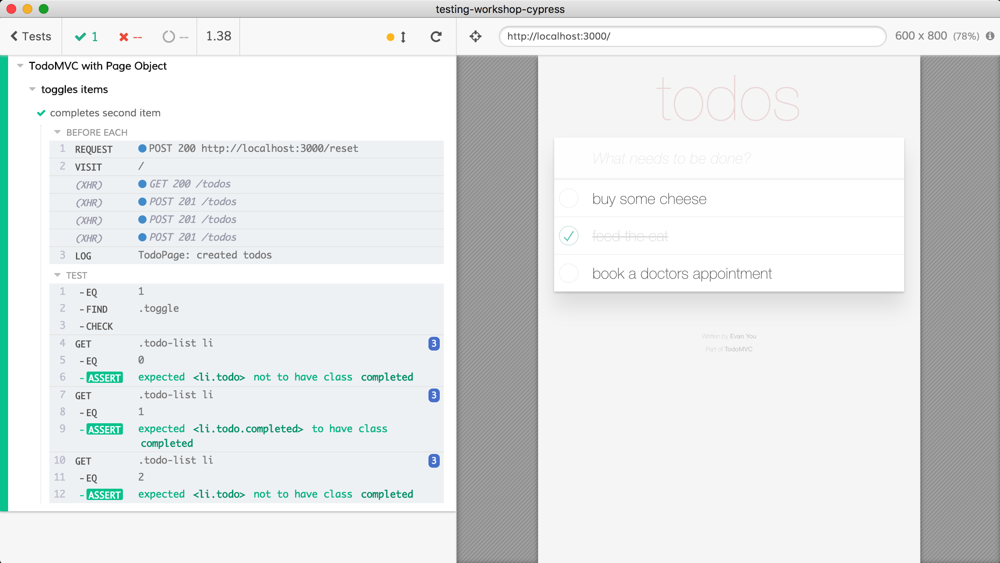

## ☀️ Part 13: App Actions

### 📚 You will learn

- how to organize test code using Page Objects
- how to call into application directly from tests
- benefits of App Actions

+++

## Based on

- 📝 blog [Stop using Page Objects and Start using App Actions](https://www.cypress.io/blog/2019/01/03/stop-using-page-objects-and-start-using-app-actions/)
- 💻 code [bahmutov/test-todomvc-using-app-actions](https://github.com/bahmutov/test-todomvc-using-app-actions)

+++

## How do we organize our tests?

@ul
- 👍 Cypress allows you to write a lot of E2E tests
- 👎 Cypress allows you to write a LOT of E2E tests
@ulend

+++

## Let us write a Page Object

- STOP 🛑 `todomvc` app, instead

```sh
npm run start:react
```

Full React TodoMVC implementation with routing.

Note:
We will be running a different implementation of TodoMVC at the same port. So stop previous app server and start the new app from the root folder using the above command.

+++

- find Page Object in `cypress/integration/13-app-actions/todo-page-object.js`
- open `cypress/integration/13-app-actions/using-po-spec.js`

+++

## Todo: write create todos test

use the page object methods

```js
beforeEach(() => {
  // visit the page
})

it('creates 3 todos', () => {
  // create default todos
  // and check that there are 3 of them
})
```

+++

```js
import { todoPage } from '../todo-page-object'

beforeEach(() => {
  todoPage.visit()
})

it('creates 3 todos', () => {
  todoPage.createTodos()
  const todos = todoPage.todos()
  todos.should('have.length', 3)
})
```

Note:
The object-oriented wrapper and imperative style in the code.

+++

## Todo: write toggle test

```js
// cypress/integration/13-app-actions/using-po-spec.js
context('toggles items', () => {
  beforeEach(() => {
    // what should you do before each test?
  })

  it('completes second item', () => {
    // toggle 1 item
    // check class names for all 3 items
  })
})
```

+++



Note:
Our goal is to use todo page instance to create todos, then toggle one of them (again using the page object), then confirm class names like `todoPage.todos(0).should('not.have.class', 'completed')`.

+++

```js
beforeEach(() => {
  todoPage.createTodos()
})
it('completes second item', () => {
  todoPage.toggle(1)
  todoPage.todos(0).should('not.have.class', 'completed')
  todoPage.todos(1).should('have.class', 'completed')
  todoPage.todos(2).should('not.have.class', 'completed')
})
```

+++

You can implement Page Objects using classes, custom commands or simple functions.

+++

## My problems with the Page Object

@ul
- goes through the page DOM (slow)
- adds extra layer of code on top of unstable DOM
- duplicates code already in the app
@ulend

+++

```
      Tests

-----------------       tight

  Page Objects

~ ~ ~ ~ ~ ~ ~ ~ ~     very loose

    HTML UI

-----------------       tight

Application code
```

+++

## Code overhead

@ul
- What methods do you have in the Page Object?
- What methods do you see in `todomvc-react/js/todoModel.js`?
@ulend

+++

```js
// app.jsx
var model = new app.TodoModel('react-todos')
if (window.Cypress) {
  window.model = model
}
```

## Todo: access `model` from DevTools console

+++

## Todo: create a todo from DevTools console

and toggle an item

+++

> 💡 Cypress can do anything you can do from the DevTools console

+++

## Todo: start a new file `spec.js`

- gets the `window.model` instance
- invokes `addTodo` to add several todos

**tip:** use [`cy.invoke`](https://on.cypress.io/invoke)

Note:
Look up and improve `addTodo` method in `js/todoModel.js` if necessary

+++

## Todo: write a test for routing

- set up initial todos using app action `addTodo`
- toggle an item or two
- check if each view shows correct number of items

+++

## More tests

Open and run `cypress/integration/13-app-actions/po-full-spec.js`. It has tests for

- adding todos
- editing
- toggling
- routing

+++

Look at the group of tests for "New Todo". They all go through the DOM

Look at the group of tests for "Routing"

```js
context('Routing', function () {
  beforeEach(function () {
    todoPage.createTodos()
  })
  // routing tests
})
```

+++

Most of the Page Object method calls in this spec are to create initial data or change some data (like `toggle`) - same actions as in `todoModel.js`

- Are these tests faster than before? Why?
- Are these tests coupled to the app's model or to the DOM?

+++

## App actions rules

@ul
- when testing feature X - the test goes through UI for feature X
- when testing feature Y - the test uses app action to do X
@ulend

Note:
You still cover all page features, you just don't cover them multiple times.

+++

## Focused errors

### In `todomvc-react/js/todoItem.jsx`

Comment out line in the render function

```js
onChange={this.props.onToggle}
```

Which tests have failed?

Note:
Only the tests for marking items as completed should fail, because the rest goes through the model to toggle an item.

+++

## 🏁 App actions vs Page Objects

@ul
- Page Objects write an extra layer of code
- App actions are a client of the application's model
- App actions take shortcuts for faster tests
@ulend

Note:
The extra layer of code in Page Objects is built on top of the DOM and events, which are not machine-linted. This layer also does not benefit the user, and just slows down the tests.
