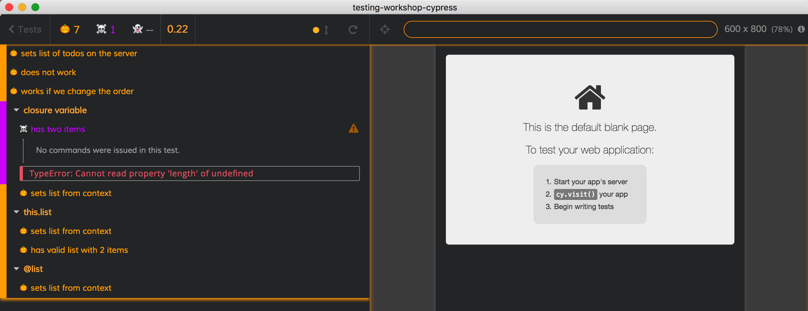

## ☀️ Part 14: Fixtures

### 📚 You will learn

- how to load and use data fixtures

+++

- start TodoMVC application using `npm start`
- open `cypress/integration/14-fixtures/spec.js`

+++

## Todo: reset server using a fixture

⌨️ test "sets list of todos on the server"

- load fixture file "cypress/integration/two-items.json"
- post the list to "/reset" as `{ todos: list }`

Tip: we are going to need [`cy.fixture`](https://on.cypress.io/fixture)

+++

## Load fixture before each test

⌨️ test "closure variable"

```js
let list
beforeEach(() => {
  cy.fixture('two-items')
  // then store the loaded items in variable "list"
})
it('sets list from context', () => {
  // post items to the server
})
```

+++

## Store data in test context

In Mocha, hooks like `before`, `beforeEach`, `it` can store data in "this" object, if the callbacks use "function () { ... }" form.

```js
beforeEach(function () {
  this.foo = 'bar'
})
it('has foo', function () {
  expect(this.foo).to.equal('bar')
})
```

+++

## Load fixture before each test

⌨️ test context "this.list"

```js
context('this.list', () => {
  beforeEach(function () {
    cy.fixture('two-items')
    // then assign value to "this.list"
  })
  it('sets list from context', function () {
    // POST "this.list" to the server using "/reset"
  })
  it('has valid list with 2 items', function () {
    // check that "this.list" has 2 items
  })
})
```

+++

### ⚠️ Be careful trying to replace `beforeEach` with `before`

⌨️ test context "this.list"

Try saving time by replacing `beforeEach` with `before`.

What happens? How do you solve this?

Note:
Each test wipes away the previous context object. Thus "this.list" becomes undefined when the second test runs. You can use closure variable instead of "this" to get around this. This is a common problem when trying to save time on login.

+++

## Fixtures recipe

Check out the "Fixtures" recipe in [github.com/cypress-io/cypress-example-recipes](https://github.com/cypress-io/cypress-example-recipes) repository.

+++

## Log in once

```js
let token
before(() => {
  cy.request(...)
    .its('response.body.token')
    .then(t => {
      // save token in closure variable
      token = t
    })
})
beforeEach(() => {
  localStorage.setItem('login-token', token)
})
// each test is logged in
```

Note:
This is common solution to speeding up slow login - log in once, then store cookies and tokens and set them before each test.

+++

## `@ = this` shortcut

⌨️ test context "@list"

```js
beforeEach(function () {
  // cy.fixture(<filename>).as(<alias name>)
  cy.fixture('two-items').as('list')
})
it('works', function () {
  // inside test use "this.list
})
```

+++

## Remember the queue of commands

```js
it('does not work', function () {
  cy.fixture('two-items').as('list')
  // we are using "this.list" BEFORE it was set in
  // the above asynchronous call
  expect(this.list).to.have.length(2)
  cy.request('POST', '/reset', { todos: this.list })
})
```

Note:
Walk through each line to number the order in which commands are executed

+++

## Add command to the queue

```js
it('works if we change the order', function () {
  cy.fixture('two-items')
    .as('list')
    .then(() => {
      // by now the fixture has been saved into "this.list"
      // check that "this.list" has 2 items
      // use it to post to the server
    })
})
```

Note:
Using `cy.then` to schedule another callback will solve the problem.

+++

## Fixtures in different encoding

Todo: in file `cypress/support/index.js` uncomment

```js
require('cypress-dark/src/halloween')
```

Run at least one failing test

+++



How did the test load and play MP3?

+++

In `node_modules/cypress-dark/halloween.js`

```js
const witchLaughs = () => {
  const filename = join(getSourceFolder(), 'halloween-laugh.mp3')
  cy.readFile(filename, 'base64', { log: false }).then(mp3 => {
    const uri = 'data:audio/mp3;base64,' + mp3
    const audio = new Audio(uri)
    audio.play()
  })
}
```

+++

You can do the same with MP3 files in your fixtures folder

```js
cy.fixture('audio/sound.mp3', 'base64').then((mp3) => {
  const uri = 'data:audio/mp3;base64,' + mp3
  const audio = new Audio(uri)

  audio.play()
})
```

+++

## Other formats

```js
cy.fixture('images/logo.png').then((logo) => {
  // logo will be encoded as base64
  // and should look something like this:
  // aIJKnwxydrB10NVWqhlmmC+ZiWs7otHotSAAAOw==...
})
cy.fixture('images/logo.png', 'binary').then((logo) => {
  // logo will be encoded as binary
  // and should look something like this:
  // 000000000000000000000000000000000000000000...
})
```

+++

## `readFile` and `writeFile`

`cy.readFile` will retry until file exists and assertions that follow it pass

```js
// note: path is relative to the project's root
cy.readFile('some/nested/path/story.txt')
  .should('eq', 'Once upon a time...')
```

[on/readfile](https://on.cypress.io/readfile) and [on/writefile](https://on.cypress.io/writefile)

+++

## Todo `readFile` after POST

```js
it('reads items loaded from fixture', () => {
  cy.fixture('two-items').then(todos => {
    // post items
    // read file 'todomvc/data.json',
    // should be equal to the loaded fixture
    // note: JSON is parsed automatically!
  })
})
```

+++
## Todo `readFile` entered through UI

```js
it('saves todo', () => {
  // reset data on the server
  // visit the page
  // type new todo via GUI
  // read file - it should have the item you have entered
})
```

+++
## 🏁 Fixtures

Fixtures are data object for testing and network stubs

+++
## 🏁 Fixtures
When loading fixtures remember JavaScript + Mocha lifecycle and `this` context

+++
## 🏁 Fixtures

- [`cy.fixture`](https://on.cypress.io/fixture)
- "Fixtures" recipe in [github.com/cypress-io/cypress-example-recipes](https://github.com/cypress-io/cypress-example-recipes)
