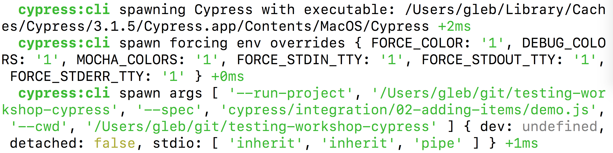
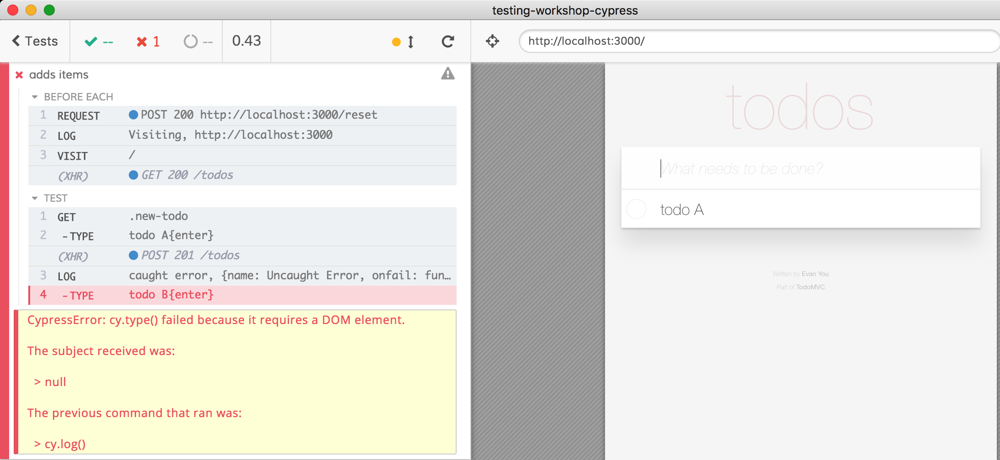

## ☀️ Part 15: Debugging

### 📚 You will learn

- how to see debug messages from Cypress itself
- how to debug individual commands
- common sources of problems

Also: [on.cypress.io/debugging](http://on.cypress.io/debugging)

+++

## Something goes wrong

👎 Documentation, [GH issues](https://github.com/cypress-io/cypress/issues) and [chat](https://on.cypress.io/chat) do not help.

Open an issue 🎉

- reproduction code
- expected results
- video / screenshots
- Cypress internal messages

+++

Typically `cypress open` works and `cypress run` does not work

+++

## Run Cypress with `DEBUG`

Stop the application server and run Cypress only.

```sh
DEBUG=cypress* \
  npx cypress run \
  --spec cypress/integration/02-adding-items/demo.js
```

Note:
You should see a LOT of messages before the error is shown

+++

Cypress uses [debug](https://github.com/visionmedia/debug#readme) module to control debug CLI messages.

Read [Good Logging](https://glebbahmutov.com/blog/good-logging/)

## Todo

```sh
# See CLI messages
DEBUG=cypress:cli npx ...
```

+++



A few debug messages from CLI module

+++

In addition to `cypress:cli` there are DEBUG name for each package in [https://github.com/cypress-io/cypress/tree/develop/packages](https://github.com/cypress-io/cypress/tree/develop/packages)

- `cypress:launcher` - controls finding and opening browsers
- `cypress:server` - the ❤️ of Cypress that controls everything

and [others](https://github.com/cypress-io/cypress/blob/develop/CONTRIBUTING.md#cypress-and-packages)

+++

## Detailed logs

**note:** there are more levels to DEBUG messages

```sh
# prints very few top-level messages
DEBUG=cypress:server ...
# prints ALL messages from server package
DEBUG=cypress:server* ...
# prints messages only from config parsing
DEBUG=cypress:server:config ...
```

This allows you to isolate the problem a little better

+++

## Debug logs in the browser

If the problem is seen during `cypress open` you can print debug logs too. Open browser DevTools

```js
localStorage.debug = 'cypress*'
// to disable debug messages
delete localStorage.debug
```

Reload the browser "Cmd + R"

+++


There is only "cypress:driver" package that runs in the browser

+++
## Step through test

Open 'cypress/integration/02-adding-items/demo.js' and add [cy.pause()](https://on.cypress.io/pause) command

```js
it('adds items', function () {
  cy.pause()
  cy.get('.new-todo')
    // ...
})
```

Note:
You can observe the application, the DOM, the network, the storage after each command to make sure everything happens as expected.

+++

## After the test has finished

```js
cy.now('command name', ...args)
  .then(console.log)
```

Runs single command _right now_. Might change in the future.

+++

## Common problems

### 👎 Missing `--`

Forgetting to use `--` when calling `npm run cy:run` with arguments

```sh
npm run cy:run --record --spec ...
```

NPM "swallows" `--record` argument

+++

## ✅ Solution

Separate NPM and Cypress arguments with `--`

```sh
npm run cy:run -- --record --spec ...
```

**note:** in the future, we will try to do the right thing even if you forget to separate with `--`, see [#3470](https://github.com/cypress-io/cypress/issues/3470)

+++
## ✅ Solution

Use [npx](https://github.com/zkat/npx) that comes with modern Node versions

```sh
npx cypress run --record --spec ...
```

+++
## ✅ Solution

Use [yarn run](https://yarnpkg.com/lang/en/docs/cli/run/)

```sh
yarn run cy:run --record --spec ...
```

+++

### 👎 Cypress GUI slows down on longer tests

Usually caused by large DOM snapshots for time-traveling debugger

- run individual specs, do not use "Run all"
- split longer tests
- use config [numTestsKeptInMemory](https://on.cypress.io/configuration#Global)

+++
## Use DevTools debugger

Just put `debugger` keyword in your callbacks

```js
it('adds items', function () {
  cy.get('.new-todo')
    .type('todo A{enter}')
    .type('todo B{enter}')
    .type('todo C{enter}')
    .type('todo D{enter}')
  // NO
  debugger
  cy.get('.todo-list li') // command
    .should('have.length', 4) // assertion
})
```

+++

```js
it('adds items', function () {
  cy.get('.new-todo')
    .type('todo A{enter}')
    .type('todo B{enter}')
    .type('todo C{enter}')
    .type('todo D{enter}')
    .then(() => {
      // YES
      debugger
    })
  cy.get('.todo-list li') // command
    .should('have.length', 4) // assertion
})
```

+++
## Todo: debug from callback function

Add custom expectation function after `c.get('.todo-list li')` to see elements it returns

+++

```js
cy.get('.todo-list li') // command
    .should($li => {
      console.log($li)
      debugger
    })
    .should('have.length', 4)
```

+++

## Todo

Try [cy.debug](https://on.cypress.io/debug) command

```js
cy.get('.todo-list li') // command
  .debug()
  .should('have.length', 4)
```

+++


+++

**note:** `debugger` and `cy.debug` only work in `cypress open` when DevTools is open.

+++
## Debug messages inside `cy.task`

To show debug messages from the backend code in `cypress/plugins`

- use `console.log`
- use `DEBUG=...` and [debug module](https://github.com/visionmedia/debug#readme)

+++
## If you app throws an error

⌨️ Add in "todomvc/app.js"

```js
// throw error when loading todos
loadTodos ({ commit }) {
  commit('SET_LOADING', true)

  setTimeout(() => {
    throw new Error('Random problem')
  }, 50)
```

+++


Cypress catches exception from the application

+++

### Todo: let's ignore the "Random problem"

Before visiting the page, set error handler

```js
cy.on('uncaught:exception', (e, runnable) => {
  console.log('error', e)
  console.log('runnable', runnable)
  // return true if you WANT test to fail
})
```

+++

If you want to print the caught error:

```js
beforeEach(function visitSite () {
  cy.log('Visiting', Cypress.config('baseUrl'))
  cy.on('uncaught:exception', (e, runnable) => {
    console.log('error', e)
    console.log('runnable', runnable)
    // this is NOT going to work
    cy.log('caught error', e)
    // return true if you WANT test to fail
    return false
  })
  cy.visit('/')
})
```

+++


`cy.log` changes _current_ command chain.
+++

You might try to use `Cypress.log` instead, but there is a problem [#3513](https://github.com/cypress-io/cypress/issues/3513). So use this secret method to log

```js
cy.on('uncaught:exception', (e, runnable) => {
  console.log('error', e)
  console.log('runnable', runnable)
  cy.now('log', 'caught error', e)
  // return true if you WANT test to fail
  return false
})
```

+++
## Todo: set up global error handler

in "cypress/support/index.js"

```js
Cypress.on('uncaught:exception', (e, runnable) => {
  console.log('error', e)
  console.log('runnable', runnable)
  // return true if you WANT test to fail
})
```

+++
## How to debug "cypress run" failures

### 🔪 Isolate the problem

@ul
- look at the video recording and screenshots
- split large spec files into smaller ones
- split long tests into shorter ones
- run using `--browser chrome`
@ulend

Note:
We are working on upgrading the Electron version shipped with Cypress.

+++
## 👎 There is no command log in the terminal output

Cypress tests run in the browser.

We are working to send all browser events during the test to the terminal [#448](https://github.com/cypress-io/cypress/issues/448)

+++
## cypress-failed-log

> Saves the Cypress test command log as a JSON file if a test fails

Userspace plugin [bahmutov/cypress-failed-log](https://github.com/bahmutov/cypress-failed-log)

+++
## Todo

- `cypress-failed-log` is already installed in this repo
- follow instructions in `cypress-failed-log` README and turn it on

Note:
Need to uncomment the command in `cypress/support/index.js` and add task in `cypress/plugins/index.js`

+++
## Run failing test

- add a failure to the `cypress/integration/02-adding-items/demo.js` spec
- run this spec from the command line to see the command log

Note:
expected result is on the next slide

+++


`cypress-failed-log` output.

**note:** there is also a JSON file with the log

+++
## 🏁 Debugging is hard

- race conditions in your application
- bugs in Cypress
- weird browser and server behavior

+++
## 🏁 Use DevTools

`debugger` and `cy.debug()`

Pauses _both tests and application_

### Todo: demonstrate this

Note:
It is nice to show how `debugger` pause stops all application's timers.

+++
## 🏁 Isolate the problem

- smaller specs and tests
- failed log
- `DEBUG=...` verbose logs
