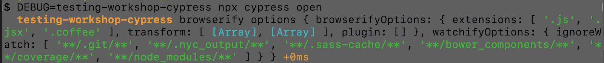
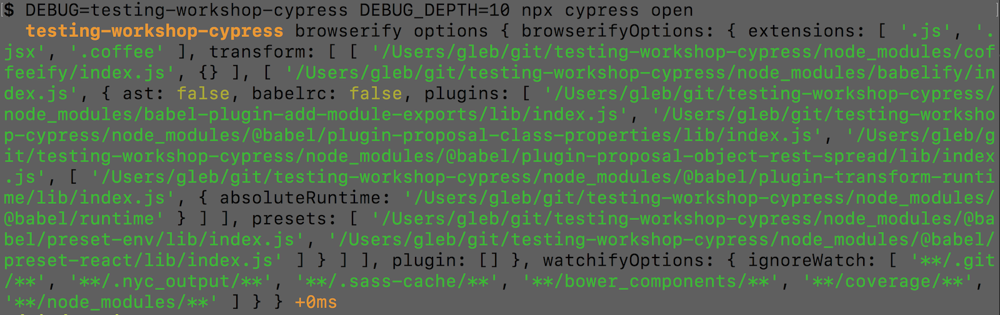
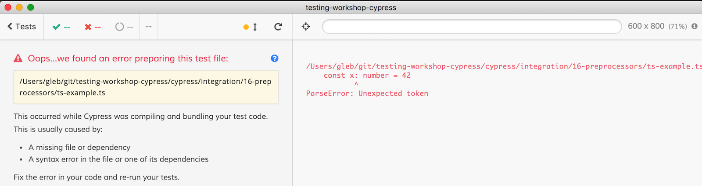

## ☀️ Part 16: Preprocessors

A preprocessor is the plugin responsible for preparing a support file or a test file for the browser.

+++
### 📚 You will learn

- how to change options when bundling specs
- how to use TypeScript specs

+++
## Not covered

Writing your own preprocessor, see [on.cypress.io/preprocessors-api](https://on.cypress.io/preprocessors-api) for how

+++

- start TodoMVC application using `npm start`
- open `cypress/integration/16-preprocessors/spec.js`

+++
## Specs

Are bundled by default using [Cypress browserify preprocessor](https://github.com/cypress-io/cypress-browserify-preprocessor)

Or you can use [Cypress webpack preprocessor](https://github.com/cypress-io/cypress-webpack-preprocessor)

+++
## Default options

```sh
npm i -D @cypress/browserify-preprocessor
```
```js
// cypress/plugins/index.js
const browserify = require('@cypress/browserify-preprocessor')
module.exports = (on, config) => {
  on('file:preprocessor', browserify())
}
```

+++
## Changing options

```js
// cypress/plugins/index.js
const browserify = require('@cypress/browserify-preprocessor')
module.exports = (on, config) => {
  const options = browserify.defaultOptions
  options.foo = 'my value'
  on('file:preprocessor', browserify(options))
}
```

Note:
Instead of specifying all new options, modify a deep property inside the default options.

+++
## Todo: print default options

Add `debug` call to show default browserify options used to bundle spec files

```js
// cypress/plugins/index.js
const browserify = require('@cypress/browserify-preprocessor')
// convention: use name of the repo
const debug = require('debug')('testing-workshop-cypress')
module.exports = (on, config) => {
  const options = browserify.defaultOptions
  // try %o - prints object on a single line
  // or %O - prints object on multiple lines
  debug('browserify options %o', options)
  on('file:preprocessor', browserify(options))
}
```

+++



+++
We need to print deeper options. Use `DEBUG_DEPTH=10`



+++

Includes 2 transforms by default

- [coffeeify](https://github.com/jnordberg/coffeeify) with no options
- [babelify](https://github.com/babel/babelify) with plugins and presets
  * `babel-plugin-add-module-exports`
  * `plugin-proposal-class-properties`
  * `plugin-proposal-object-rest-spread`
  * `@babel/preset-env`
  * `@babel/preset-react`

Look at the test code that transpile in `spec.js`, including JSX

+++

## Todo: add Babel plugin

Let's enable [`do` notation]() in our spec

⌨️ test "transpiles do expression"

+++

```js
const options = browserify.defaultOptions
const babelOptions = options.browserifyOptions.transform[1][1]
const babelPlugins = babelOptions.plugins
babelPlugins.push('@babel/plugin-proposal-do-expressions')
on('file:preprocessor', browserify(options))
```

+++
## 👍 Alternative: add .babelrc file

Create `.babelrc` file
```json
{
  "plugins": [
    "@babel/plugin-proposal-do-expressions"
  ]
}
```
and enable `babelOptions.babelrc = true` option.

Note:
Plugins list is concatenated from default and `.babelrc` list.

+++
## Todo: add your own plugin

Find a plugin in [https://babeljs.io/docs/en/next/plugins](https://babeljs.io/docs/en/next/plugins) and add it to the Babel plugins and write test that uses the new notation. Good candidates

- function bind
- pipeline operator
- optional chaining

+++
## Browserify TypeScript specs

Based on [TypeScript with Browserify](https://github.com/cypress-io/cypress-example-recipes/tree/master/examples/preprocessors__typescript-browserify) example recipe.

Open test file `ts-example.ts`

+++



+++

**Todo:** use Browserify plugin `tsify` in `plugins/index.js` to transpile TypeScript specs

- need to install TypeScript and plugin
- need to set up preprocessor
- need to have `tsconfig.json`

**Tip:** [TypeScript with Browserify](https://github.com/cypress-io/cypress-example-recipes/tree/master/examples/preprocessors__typescript-browserify) example recipe

**Tip:** pay attention to any error messages in the terminal

+++
## Install

```sh
npm i -D typescript tsify
```

+++

## Preprocessor

```js
// plugins/index.js
const browserify = require('@cypress/browserify-preprocessor')
const options = {
  browserifyOptions: {
    extensions: ['.js', '.ts'],
    plugin: [['tsify']]
  }
}
on('file:preprocessor', browserify(options))
```

+++
## `tsconfig.json`

```json
{
  "compilerOptions": {
    "target": "es5",
    "module": "commonjs",
    "skipLibCheck": true, // do not check types in node_modules folder
    "strict": true
  },
  "include": [
    "node_modules/cypress",
    "cypress/**/*.ts"
  ]
}
```

+++
## TypeScript with Webpack

See [Preprocessors TypeScript with Webpack](https://github.com/cypress-io/cypress-example-recipes/tree/master/examples/preprocessors__typescript-webpack) example recipe

You can use [bahmutov/add-typescript-to-cypress](https://github.com/bahmutov/add-typescript-to-cypress) to set it up.

+++
## Common TypeScript problems

- clashing 3rd party `@types` fixing in [#3371](https://github.com/cypress-io/cypress/issues/3371)
- Jest vs Chai `expect` global
- incorrect type definitions
- transpile `plugins/index` itself

+++
## 📖 TypeScript Deep Dive

Free to read ebook at [basarat.gitbooks.io/typescript](https://basarat.gitbooks.io/typescript/)

Has a great Cypress section [/testing/cypress.html](https://basarat.gitbooks.io/typescript/docs/testing/cypress.html)

+++
## 👍 Use Webpack preprocessor

If your project already uses `webpack.config.js`

```sh
npm i -D @cypress/webpack-preprocessor
```
```js
const webpack = require('@cypress/webpack-preprocessor')
module.exports = (on) => {
  const options = {
    // send in the options from your webpack.config.js,
    // so it works the same as your app's code
    webpackOptions: require('../../webpack.config'),
    watchOptions: {},
  }
  on('file:preprocessor', webpack(options))
}
```

+++
## 🏁 You can control how spec files are transpiled

- modify default browserify options
- overwrite or use Webpack bundler
