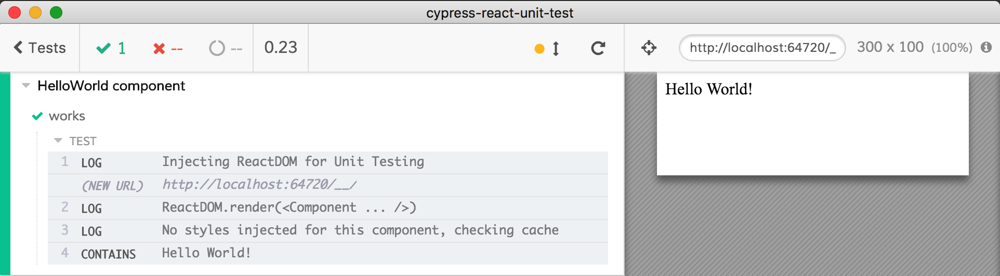
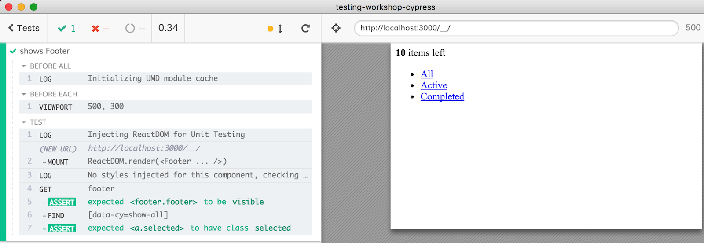
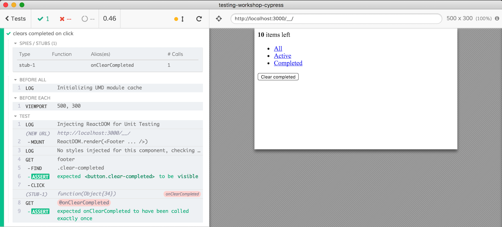

## ☀️ Part 17: Component Testing

### 📚 You will learn

- how to test React components in isolation

+++
## Component testing

* [cypress-react-unit-test](https://github.com/bahmutov/cypress-react-unit-test)
* [cypress-vue-unit-test](https://github.com/bahmutov/cypress-vue-unit-test)
* [cypress-cycle-unit-test](https://github.com/bahmutov/cypress-cycle-unit-test)
* [cypress-svelte-unit-test](https://github.com/bahmutov/cypress-svelte-unit-test)
* [cypress-angular-unit-test](https://github.com/bahmutov/cypress-angular-unit-test)
* [cypress-hyperapp-unit-test](https://github.com/bahmutov/cypress-hyperapp-unit-test)
* [cypress-angularjs-unit-test](https://github.com/bahmutov/cypress-angularjs-unit-test)

[on.cypress.io/plugins#component-testing](http://on.cypress.io/plugins#component-testing)

+++
## 💡 Idea

Instead of loading an HTML page, create an empty page and mount a component X
+++

```jsx
import React from 'react'
const HelloWorld = () => <p>Hello World!</p>
describe('HelloWorld component', () => {
  it('works', () => {
    cy.mount(<HelloWorld />)
    cy.contains('Hello World!')
  })
})
```

**⚠️ note:** component testing API is likely to change

+++



+++
## First component test

- **stop** TodoMVC application
- open `cypress/integration/17-component-testing/footer-spec.js`

+++

```js
/// <reference types="cypress" />
import React from 'react'
import Footer from './Footer'
// adds custom command "cy.mount"
import 'cypress-react-unit-test'
import { filters } from './filters'
```
Note how we are loading React components and application code directly from the spec file

+++

## Todo: first component test

⌨️ test "shows Footer"

- mount component
- link "all" should have selected class

+++



+++

## Todo: test on click

⌨️ test "clears completed on click"

- mount component
- pass stub to "onClearCompleted" prop
- check if "clear completed" button is visible and click

+++


+++
## Component testing vs E2E

- components are like micro web applications

+++
## Unit tests vs E2E

### Unit tests

- focus on code
- short
- black box

+++
## Unit tests vs E2E

### end-to-end tests

- focus on a feature
- long
- external effects

+++
## Unit tests AND E2E

- focus on one thing
- gives you confidence
- runs locally and on CI

+++
## 🏁 Component testing

@ul
Instead of visiting a page, you mount a component.
Then you test it the same way as a full E2E test.
@ulend

+++
## 🏁 Component testing: more info

- [cypress-react-unit-test](https://github.com/bahmutov/cypress-react-unit-test)
- [on.cypress.io/plugins#component-testing](https://on.cypress.io/plugins#component-testing)
- [github.com/bahmutov/calculator](https://github.com/bahmutov/calculator)
- blog post [Sliding Down the Testing Pyramid](https://www.cypress.io/blog/2018/04/02/sliding-down-the-testing-pyramid/)
