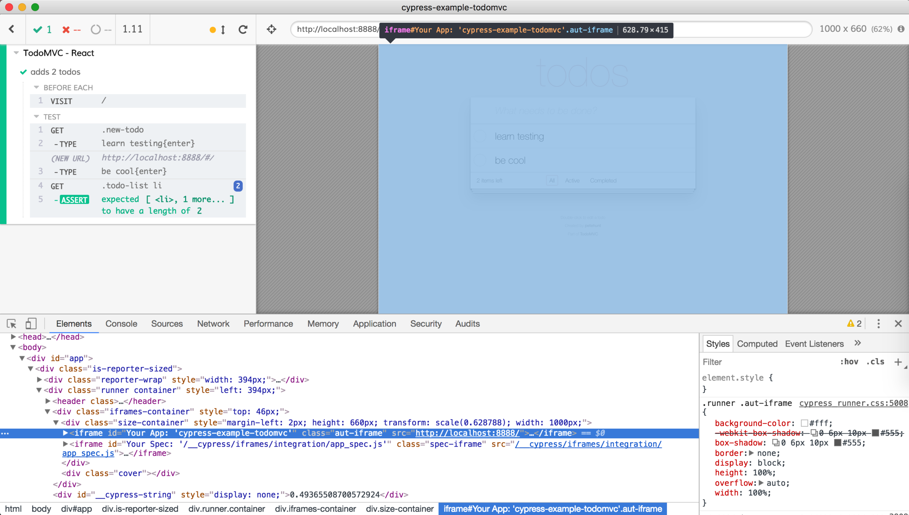
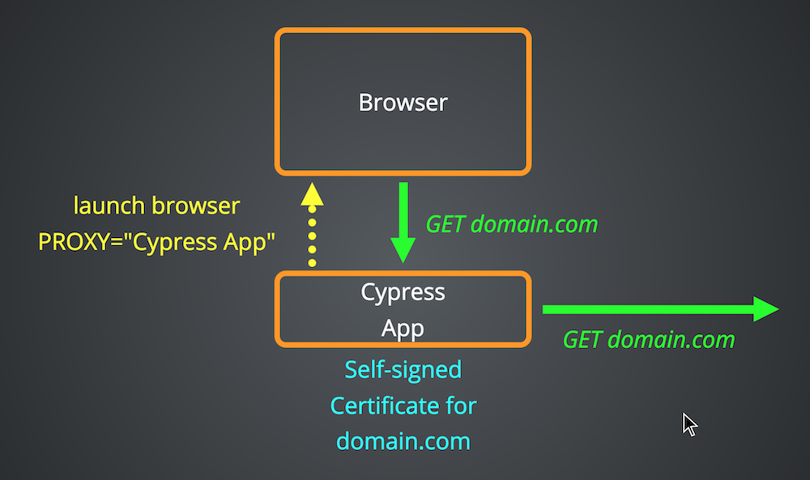
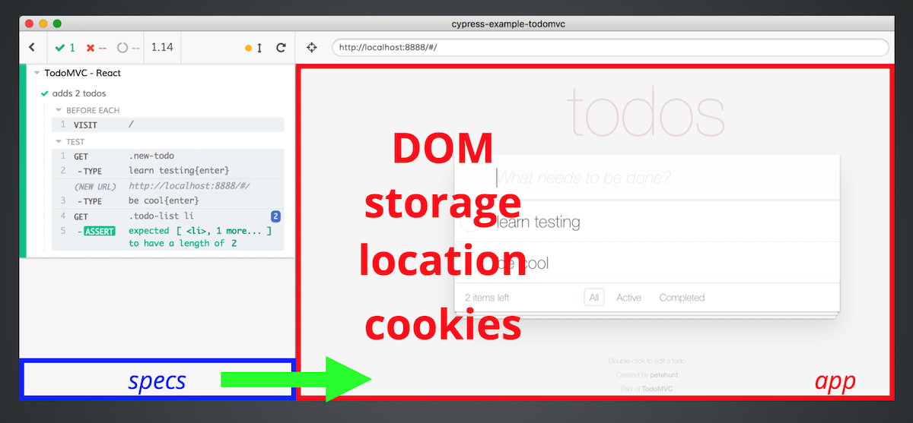

## ☀️ Part 18: The Backend Code

### 📚 You will learn

- how to execute code in Node context

+++

- start TodoMVC application using `npm start`
- open `cypress/integration/18-backend/spec.js`

+++
## Cypress architecture: browser

There are two iframes: one for the app, one for the specs.

[on.cypress.io/key-differences](https://on.cypress.io/key-differences)

+++


One iframes has the application, second iframe has spec code for isolation

+++


Note:
You can find the iframe HTML elements side by side. The one with the specs has zero dimensions. The Cypress Command Log is in the top window around the iframes.

+++


Note:
In order for spec iframe (coming from localhost) to access the app iframe (coming from any domain), we inject a little JavaScript snippet shown here at the very start, which sets the document domain to be `localhost`. This gives Cypress access to the application's DOM and `window` and everything.

+++


Note:
Cypress starts the browser in proxy mode. Every request your application makes to its domain goes through Cypress

+++


Note:
Before Cypress forwards the request to the external domain, it creates and injects a self-signed certificate for that domain - and then forwards the request.

+++


Note:
When the external server responds with the page, Cypress injects the little script I have shown to set the document's domain to `localhost`

+++


Specs can access the app iframe.

Note:
After that Cypress can access everything inside the application iframe, except for inner iframes coming from other domains.

+++


Note:
And Cypress can observe and stub network calls coming from the application because it still acts as a proxy.

+++
## Cypress architecture: Node

- tests run in the browser
- what if you need OS actions during test?
  * access file system
  * access database

+++


Run code in Node using [`cy.task`](https://on.cypress.io/task)

+++
## Explore tasks

- keep running TodoMVC application using `npm start`
- open `cypress/integration/18-backend/spec.js`
- open `cypress/plugins/index.js` with task code

+++
## Todo: write a "hello world" task

- caller will pass the name from the test
- task will respond with `hello ${name}`
- test should confirm the result

**Tip:** you can call "on('task')" multiple times, the task names will be merged.

+++
```js
it('runs hello world', () => {
  cy.task('hello', 'world').should('equal', 'hello, world')
})
```
```js
// in plugins file
on('task', {
  hello: name => `hello, ${name}`
})
```
**note:** Cypress does not watch plugins file.

+++
## Bonus

Print `process.version` from the task

+++
## Todo: write asynchronous task

Change task "runs hello world" to return a Promise.

+++
```js
on('task', {
  hello: name => {
    return new Promise((resolve, reject) => {
      setTimeout(() => {
        resolve(`hello, ${name}`)
      }, 1000)
    })
  }
})
```
**note:** there is no handy `Cypress.Promise` Bluebird in Node

+++
## Retries in tasks

@ul
- Look at existing task `hasSavedRecord` and trace what it does
- Write a test that calls task `hasSavedRecord`
- Delay application to demonstrate that task retries
@ulend

+++
## Retries libraries

You can do retries yourself, or bring a library like

- [promise-retry](https://github.com/IndigoUnited/node-promise-retry#readme)
- [bigtestjs/convergence](https://github.com/bigtestjs/convergence)
- [wait-for-expect](https://github.com/TheBrainFamily/wait-for-expect)

+++
## Dynamic tasks

Make a task that makes new tasks

```js
it('makes task and runs it', () => {
  function hello (name) {
    return 'hello, ' + name
  }
  cy.task('eval', hello.toString())
  cy.task('hello', 'eval').should('equal', 'hello, eval')
})
```

+++
```js
on('task', {
  eval (newTaskFn) {
    const name = newTaskFn.match(/^function (\w+)/)[1]
    const newTask = /* js */ `
      on('task', {
        ${name}: ${newTaskFn}
      })
    `
    eval(newTask)
    return null
  }
})
```
**tip:** use "Comment tagged templates" to syntax highlight using `/* js */`

Note:
While this is possible, you still are sending just a string to the backend, so you linter cannot tell you if the code you are sending makes sense or not.

+++
## 🏁 Architecture

There are 2 iframes in the browser controlled by Cypress. Specs have full access to the application.

+++
## 🏁 Architecture

Node context is _strongly_ separated from the browser context. Use `cy.task` to cross the border.

- initializing data before the test
- checking external services during test
