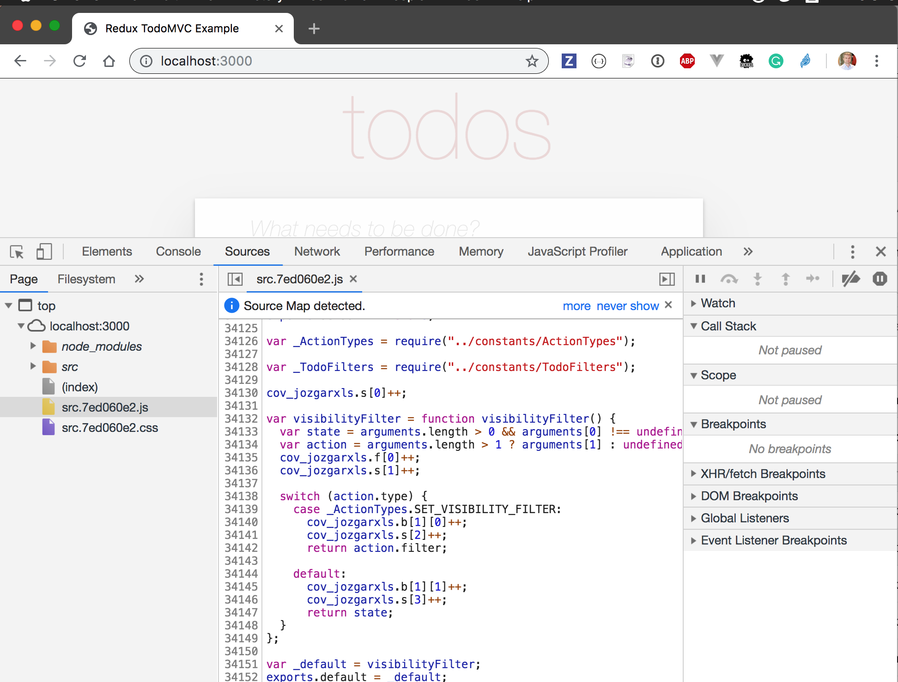
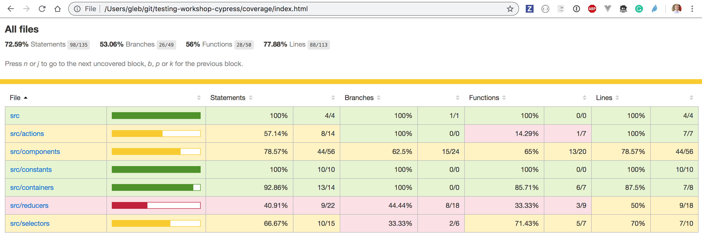
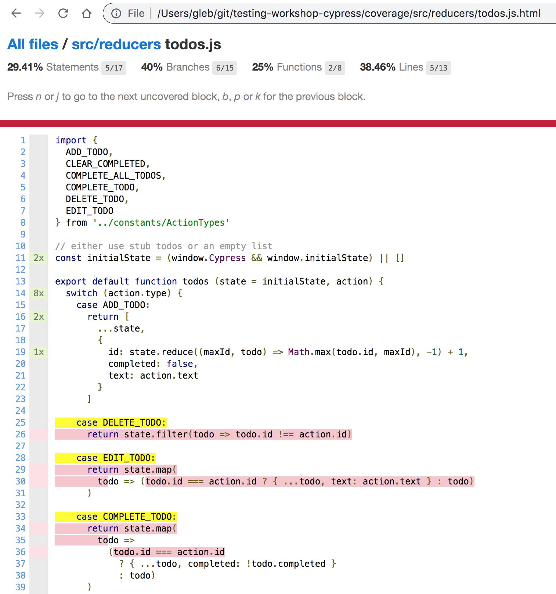

## ☀️ Part 19: Code Coverage

### 📚 You will learn

- how to collect code coverage information
- how to write e2e tests effectively using code coverage as your 🗺

+++

## ⚠️ use `todomvc-redux` application

- stop TodoMVC
- in one terminal go into `todomvc-redux` and `npm start` there

Note:
This will start application and instrument the code on the fly

+++

Open `localhost:3000` and observe instrumented code (the `.js` bundle). The original code can be seen via source maps.

+++



+++

The code coverage object keeping track of all code lines hit is in the `window.__coverage__` object.

Note:
Explain its structure

+++

We are going to use [@cypress/code-coverage][plugin] plugin to manage and save this `window.__coverage__` object and generate coverage reports.

## Todo

- enable `@cypress/code-coverage` lines in `cypress/support/index.js` file
- enable `@cypress/code-coverage` lines in `cypress/plugins/index.js` file

+++

## Todo

- start Cypress with `npm run cy:open`
- execute test `cypress/integration/19-code-coverage/spec.js`
- open generated `coverage/index.html` in your browser

+++



+++

Drill down into individual files, for example todos reducer



+++

## Todo 1/3

- see code coverage summary from the terminal with

```shell
npx nyc report --reporter=text
npx nyc report --reporter=text-summary
```

+++

## Todo 2/3

- see code coverage HTML report

```shell
open coverage/lcov-report/index.html
```

+++

## Todo 3/3

- add tests to cover more source lines

**Note:** this application does not have data persistance or server API calls

+++

## Advanced

Can you cover every line via end-to-end tests? How about edge cases?

+++
## 🏁 Code coverage

[@cypress/code-coverage][plugin] plugin manages coverage information from e2e and unit tests and generates HTML report

+++
## 🏁 Code coverage

Read Cypress code coverage guide at [https://on.cypress.io/code-coverage](https://on.cypress.io/code-coverage)

Idea: you can send code coverage information to external services. Read [https://glebbahmutov.com/blog/combined-end-to-end-and-unit-test-coverage/](https://glebbahmutov.com/blog/combined-end-to-end-and-unit-test-coverage/)

[plugin]: https://github.com/cypress-io/code-coverage
