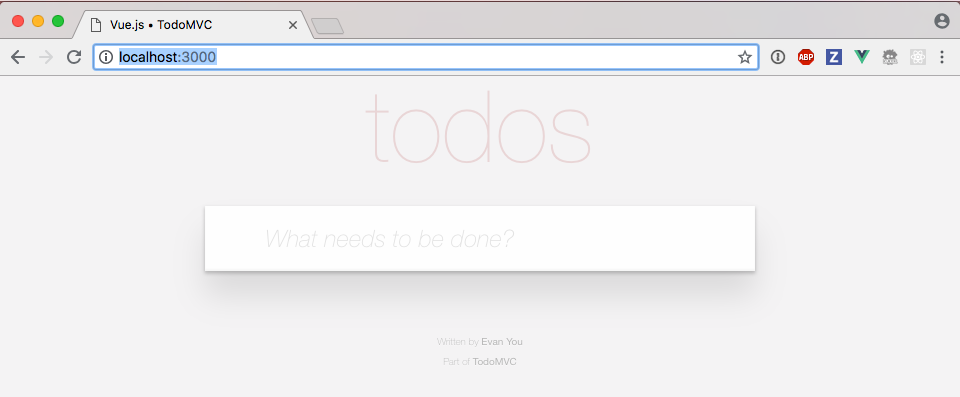
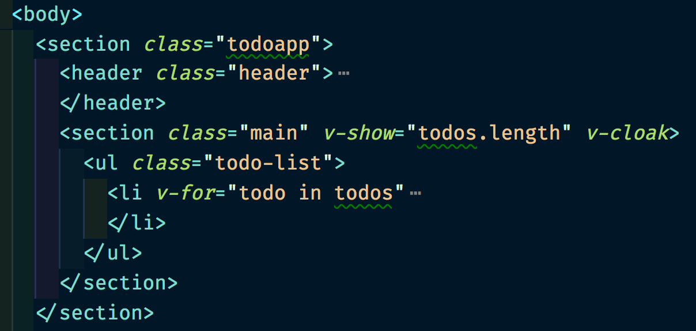
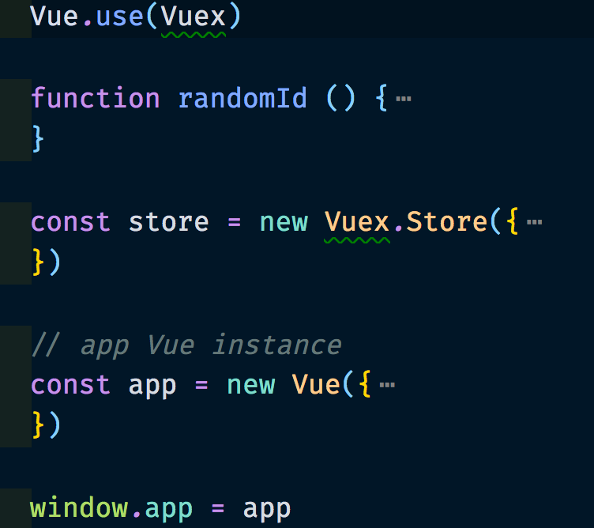

# Cypress Testing Workshop

- [github.com/cypress-io/testing-workshop-cypress](https://github.com/cypress-io/testing-workshop-cypress)

Jump to: [00-start](?p=00-start), [01-basic](?p=01-basic), [02-adding-items](?p=02-adding-items), [03-selector-playground](?p=03-selector-playground), [04-reset-state](?p=04-reset-state), [05-xhr](?p=05-xhr), [06-app-data-store](?p=06-app-data-store), [07-ci](?p=07-ci), [08-dashboard](?p=08-dashboard), [09-reporters](?p=09-reporters), [10-configuration](?p=10-configuration), [11-retry-ability](?p=11-retry-ability)

+++
## Gleb Bahmutov, PhD

- Distinguished Engineer at Cypress
- gleb (at) cypress.io
- [@bahmutov](https://twitter.com/bahmutov)
- [https://glebbahmutov.com/blog/tags/cypress/](https://glebbahmutov.com/blog/tags/cypress/)
- [https://www.youtube.com/glebbahmutov](https://www.youtube.com/glebbahmutov)

+++

## What we are going to cover 1/3

As long as ⏳ permits

- example TodoMVC
  * web app, data store, REST calls
- basic page load test
- selector playground
- resetting state
- XHR spying and stubbing, fixtures

+++

## What we are going to cover 2/3

As long as ⏳ permits

- CI and Cypress dashboard
- test reporters
- configuration and environment variables
- retry-ability
- debugging
- visual testing

+++
## What we are going to cover 3/3

As long as ⏳ permits

- page objects vs app actions
- fixtures and backend
- preprocessors
- component testing
- plugins
- code coverage

+++

## Time 🕰

- total workshop duration 3 - 9 hours, depending on the included sections
- short breaks, lunch

+++

Please: if you have experience with Cypress.io, help others during the workshop 🙏

+++

## How learning works

1. I explain and show
2. We do together
3. You do and I help

+++

## Requirements

You will need:

- `git` to clone this repo
- Node v10+ to install dependencies
- Node v12 recommended

```text
git clone <repo url>
cd testing-workshop-cypress
npm install
```

+++

## Repo organization

- `/todomvc` is a web application we are going to test
- all tests are in `cypress/integration` folder
  - there are subfolders for exercises
    - `01-basic`
    - `02-adding-items`
    - `03-selector-playground`
    - `04-reset-state`
    - etc
- keep application `todomvc` running!

Note:
We are going to keep the app running, while switching from spec to spec for each part.

+++

## `todomvc`

Let us look at the application.

- `cd todomvc`
- `npm start`
- `open localhost:3000`

**important** keep application running through the entire workshop!

+++

It is a regular TodoMVC application.



+++

If you have Vue DevTools plugin


+++

Look at XHR when using the app


+++

Look at `todomvc/index.html` - main app DOM structure



+++

Look at `todomvc/app.js`



+++

## Questions

@ul
- what happens when you add a new Todo item?
- how does it get to the server?
- where does the server save it?
- what happens on start up?
@ulend

Note:
The students should open DevTools and look at XHR requests that go between the web application and the server. Also the students should find `todomvc/data.json` file with saved items.

---


Note:
This app has been coded and described in this blog post [https://www.cypress.io/blog/2017/11/28/testing-vue-web-application-with-vuex-data-store-and-rest-backend/](https://www.cypress.io/blog/2017/11/28/testing-vue-web-application-with-vuex-data-store-and-rest-backend/)

+++

This app has been coded and described in this blog post [https://www.cypress.io/blog/2017/11/28/testing-vue-web-application-with-vuex-data-store-and-rest-backend/](https://www.cypress.io/blog/2017/11/28/testing-vue-web-application-with-vuex-data-store-and-rest-backend/)

➡️ Pick the [next section](https://github.com/cypress-io/testing-workshop-cypress#content-)
